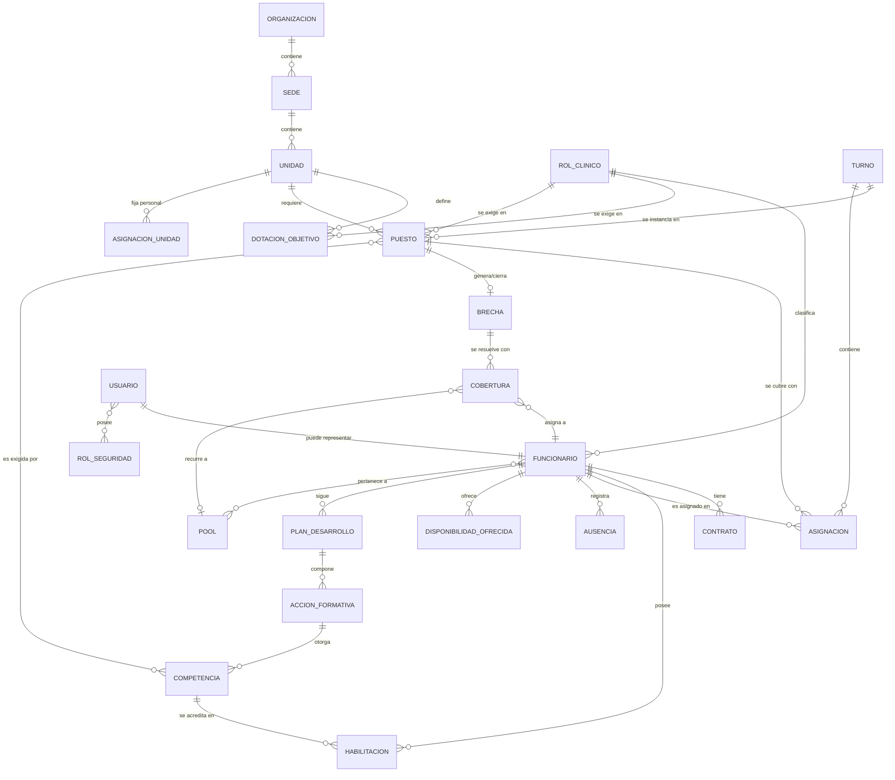

# 02 · Modelo de dominio

El modelo de dominio describe **las entidades del negocio y sus relaciones**, con independencia de la tecnología. Es la base semántica de la SSOT: cada entidad tiene **un solo dueño** y los demás módulos la **referencian**, nunca la copian.

## 2.1 Mapa de entidades



## 2.2 Entidades y su dueño (SSOT)

Cada entidad pertenece a **un módulo dueño**. Ese módulo es el único que la puede crear/modificar; el resto la lee.

| Entidad | Descripción | Módulo dueño |
|---------|-------------|--------------|
| **Organización / Sede / Unidad** | Estructura organizativa. | Personal y Organización |
| **Rol clínico / Profesión** | Categorías de personal. | Personal y Organización |
| **Funcionario** | Persona trabajadora. | Personal y Organización |
| **Contrato** | Vínculo laboral, jornada/FTE, tope de horas. | Personal y Organización |
| **Competencia** | Capacidad verificable. | Habilitación y Competencias |
| **Habilitación** | Funcionario ↔ competencia/unidad, con vigencia. | Habilitación y Competencias |
| **Dotación objetivo** | Demanda de roles por unidad/turno. | Programación |
| **Turno** | Bloque horario. | Programación |
| **Puesto** | Requerimiento concreto (unidad+turno+fecha+rol+competencias). | Programación |
| **Asignación** | Funcionario en un turno. | Programación |
| **Ausencia** | No disponibilidad temporal. | Ausencias |
| **Disponibilidad ofrecida** | Ventanas que el funcionario ofrece para cubrir. | Coberturas |
| **Brecha** | Déficit puesto vs disponibilidad (entidad **derivada**). | Detección de Brechas (calculada) |
| **Cobertura** | Acción de resolución de una brecha. | Coberturas |
| **Pool / Flotante** | Grupo de personal transversal. | Coberturas |
| **Plan de desarrollo / Acción formativa** | Ruta de formación. | Desarrollo Profesional |
| **Usuario / Rol de seguridad** | Identidad y permisos. | Administración y Seguridad |
| **KPI / Indicador** | Métricas derivadas. | Analítica (calculada) |
| **Evento / Registro de auditoría** | Trazabilidad. | Administración y Seguridad (transversal) |

> **Nota clave:** `Brecha` y los `KPI` son entidades **derivadas** — no se editan a mano, se **calculan** a partir de las entidades base. Esto garantiza que nunca queden desincronizadas. Ver [05 · SSOT](./05-fuente-unica-de-verdad.md).

## 2.3 La ecuación central: cómo nace una brecha

Para cada tupla **(unidad, turno, fecha, rol clínico)**:

```
Demanda        = Dotación objetivo (cantidad requerida del rol)
Oferta bruta   = Nº de asignaciones programadas para ese puesto
Oferta neta    = Oferta bruta
                 − asignados en ausencia (aprobada o en curso)
                 − asignados NO habilitados (competencia vencida/faltante)

Brecha         = Demanda − Oferta neta
```

- `Brecha > 0` → **déficit** (falta personal): se abre una `Brecha` a resolver.
- `Brecha = 0` → **equilibrio**.
- `Brecha < 0` → **exceso** (sobredotación): oportunidad de reasignar a otra unidad.

La **severidad** de una brecha combina:
1. Magnitud (`Brecha / Demanda`).
2. Criticidad de la unidad (UCI/Urgencias > unidades de menor riesgo).
3. Proximidad temporal (una brecha para hoy pesa más que una para dentro de 3 semanas).

Estas tres dimensiones alimentan la priorización automática de la cola de coberturas ([04](./04-flujo-brecha-a-resolucion.md)).

## 2.4 Ciclos de vida (máquinas de estado)

### Ausencia
```
Solicitada → EnRevision → Aprobada  → (impacta programación → recálculo de brechas)
                        ↘ Rechazada
Aprobada → Anulada (si se revierte antes de iniciar)
```

### Brecha (derivada)
```
Detectada → Priorizada → EnGestion → Resuelta → Cerrada
                                   ↘ Escalada (si no hay cobertura viable)
Cualquier estado → Desestimada (si desaparece su causa; p. ej. se rechaza la ausencia)
```

### Cobertura
```
Propuesta → OfertaEnviada → Aceptada  → Confirmada → Cerrada
                          ↘ Rechazada → (se propone otra opción)
Confirmada → Anulada (si cae la causa o el funcionario ya no puede)
```

### Habilitación
```
Vigente → PorVencer (umbral configurable, p. ej. 30 días) → Vencida
Vencida → Renovada → Vigente
```

Cuando una habilitación pasa a `Vencida`, cualquier asignación futura de ese funcionario a un puesto que la exija deja de contar como oferta neta → **puede abrir una brecha automáticamente**.

## 2.5 Invariantes del dominio (reglas que siempre se cumplen)

1. Un funcionario **no puede** tener dos asignaciones solapadas en el tiempo.
2. Un funcionario **no puede** ser asignado a un puesto para el que no está habilitado (salvo excepción autorizada y auditada).
3. Una asignación que colisiona con una ausencia aprobada **no cuenta** como oferta neta.
4. Las horas asignadas a un funcionario en un período **no pueden** superar el tope de su contrato (control de horas extra).
5. Una `Brecha` nunca se crea ni edita manualmente: es siempre el resultado del motor de cálculo.
6. Toda transición de estado relevante emite un **evento de dominio** auditado.
