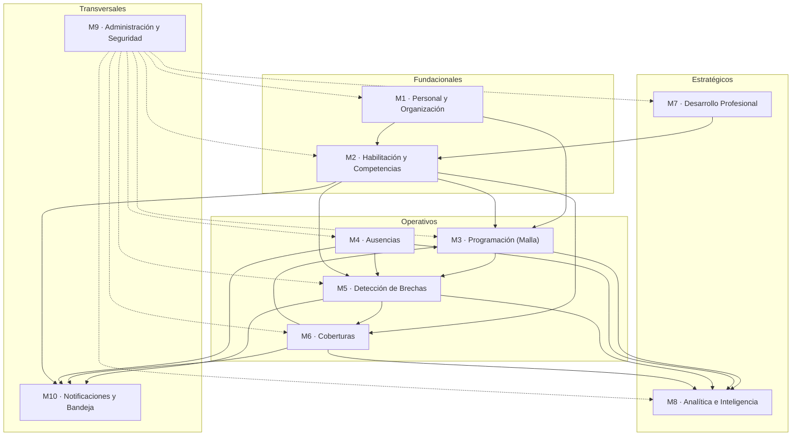

# 03 · Módulos funcionales

NEX Shift se organiza en **10 módulos**. Cada uno tiene una responsabilidad única, es **dueño** de un conjunto de entidades y se comunica con el resto **por eventos**, no por acceso directo a los datos de otro módulo.

## 3.1 Mapa de módulos y dependencias

- **Fundacionales**: definen *quién* trabaja y *qué* puede hacer.
- **Operativos**: el ciclo del día a día; contienen el flujo brecha → resolución.
- **Estratégicos**: miran al futuro (talento y datos).
- **Transversales**: sirven a todos.

## 3.2 Ficha de cada módulo

### M1 · Personal y Organización
- **Responsabilidad:** estructura organizativa (organización, sedes, unidades), personal (funcionarios, roles clínicos, contratos, FTE) y dotación objetivo por unidad/turno.
- **Entidades dueño:** Organización, Sede, Unidad, RolClínico, Funcionario, Contrato.
- **Consume:** —
- **Emite:** `FuncionarioCreado`, `ContratoActualizado`, `UnidadActualizada`, `DotacionObjetivoActualizada`.
- **Por qué importa:** es la base. Cambiar un contrato (p. ej. reducir jornada) o la dotación objetivo de una unidad recalcula brechas.

### M2 · Habilitación y Competencias
- **Responsabilidad:** catálogo de competencias, requisitos por puesto/unidad, y habilitaciones del personal con **vigencias**. Responde a "¿quién puede trabajar dónde?".
- **Entidades dueño:** Competencia, Habilitación, RequisitoDePuesto.
- **Consume:** Funcionario (M1), AcciónFormativa completada (M7).
- **Emite:** `HabilitacionOtorgada`, `HabilitacionPorVencer`, `HabilitacionVencida`, `HabilitacionRenovada`.
- **Por qué importa:** define el **conjunto de candidatos válidos** para cada cobertura. Una habilitación vencida puede abrir una brecha por sí sola.

### M3 · Programación (Malla)
- **Responsabilidad:** definición de turnos, generación y edición de la malla, creación de puestos y asignaciones. Control de topes de horas y solapamientos.
- **Entidades dueño:** Turno, Puesto, Asignación.
- **Consume:** Funcionario/Contrato (M1), Habilitación (M2), Ausencia (M4), Cobertura confirmada (M6).
- **Emite:** `AsignacionCreada`, `AsignacionModificada`, `AsignacionEliminada`, `MallaPublicada`, `PuestoAbierto`.
- **Por qué importa:** es la "oferta" de la ecuación de brecha. Publicar o editar la malla dispara detección.

### M4 · Ausencias
- **Responsabilidad:** solicitud, revisión y aprobación de ausencias (vacaciones, licencia médica, permisos, formación) y su impacto en la disponibilidad.
- **Entidades dueño:** Ausencia, TipoDeAusencia.
- **Consume:** Funcionario (M1), Asignación (M3).
- **Emite:** `AusenciaSolicitada`, `AusenciaAprobada`, `AusenciaRechazada`, `AusenciaAnulada`.
- **Por qué importa:** es la principal causa de brechas. Una ausencia aprobada retira oferta neta y dispara recálculo.

### M5 · Detección de Brechas *(motor)*
- **Responsabilidad:** **calcular** brechas de forma continua a partir de demanda (M1), oferta (M3), ausencias (M4) y habilitación (M2). Priorizar por severidad.
- **Entidades dueño:** Brecha *(derivada)*, ReglaDeSeveridad.
- **Consume:** eventos de M1, M2, M3, M4.
- **Emite:** `BrechaDetectada`, `BrechaAgravada`, `BrechaMitigada`, `BrechaCerrada`, `BrechaDesestimada`.
- **Por qué importa:** es **el corazón** de la plataforma. No tiene UI de edición: solo produce brechas que otros módulos muestran y resuelven.

### M6 · Coberturas
- **Responsabilidad:** gestionar la resolución de brechas: proponer opciones válidas (respetando habilitación, horas y costo), ofrecerlas, confirmarlas y aplicarlas a la malla. Administra el pool/flotante y la disponibilidad ofrecida.
- **Entidades dueño:** Cobertura, Pool, DisponibilidadOfrecida.
- **Consume:** Brecha (M5), Funcionario/Contrato (M1), Habilitación (M2).
- **Emite:** `CoberturaPropuesta`, `OfertaEnviada`, `CoberturaAceptada`, `CoberturaConfirmada`, `CoberturaAnulada`.
- **Por qué importa:** cierra el ciclo. Una cobertura confirmada crea/edita una asignación en M3 → mitiga la brecha en M5.

### M7 · Desarrollo Profesional
- **Responsabilidad:** planes de desarrollo, acciones formativas y ruta de carrera. Conecta la formación con nuevas competencias/habilitaciones.
- **Entidades dueño:** PlanDeDesarrollo, AcciónFormativa, RutaDeCarrera.
- **Consume:** Funcionario (M1), Competencia (M2); analiza brechas recurrentes (M5/M8) para priorizar formación.
- **Emite:** `AccionFormativaCompletada` → habilita a M2 a otorgar una `HabilitacionOtorgada`.
- **Por qué importa:** es la palanca de **capacidad futura**: formar personal amplía el pool de candidatos válidos para cubrir brechas.

### M8 · Analítica e Inteligencia
- **Responsabilidad:** KPIs, tableros, tendencias, costos y **forecasting** de demanda/ausentismo. Alimenta decisiones de Dirección y Coordinación.
- **Entidades dueño:** DefiniciónDeKPI, TableroGuardado, ModeloDeForecast *(todos derivados)*.
- **Consume:** eventos y datos históricos de M3, M4, M5, M6.
- **Emite:** `AlertaDeTendencia`, `ForecastActualizado`.
- **Por qué importa:** convierte la operación en aprendizaje; anticipa brechas antes de que ocurran.

### M9 · Administración y Seguridad *(transversal)*
- **Responsabilidad:** usuarios, autenticación, **RBAC** (roles y permisos), configuración del sistema, datos maestros, integraciones y **auditoría**.
- **Entidades dueño:** Usuario, RolDeSeguridad, Permiso, ConfiguraciónDelSistema, RegistroDeAuditoría.
- **Consume:** eventos de todos (para auditoría).
- **Emite:** `UsuarioCreado`, `RolAsignado`, `ConfiguracionCambiada`.
- **Por qué importa:** garantiza que cada perfil vea y haga solo lo que corresponde, y que todo quede trazado.

### M10 · Notificaciones y Bandeja de tareas *(transversal)*
- **Responsabilidad:** traducir eventos de dominio en **tareas accionables** y notificaciones dirigidas al rol correcto (bandeja de entrada, push, correo).
- **Entidades dueño:** Notificación, Tarea, PreferenciaDeNotificación.
- **Consume:** eventos relevantes de todos los módulos.
- **Emite:** `TareaCreada`, `NotificacionEntregada`.
- **Por qué importa:** es lo que hace que "la brecha llegue a quien debe resolverla" sin que nadie tenga que ir a buscarla.

## 3.3 Reglas de comunicación entre módulos

1. **Nada de lecturas cruzadas de tablas.** Un módulo expone su información por API/servicio; los demás la consumen, no acceden a su base directamente.
2. **Los cambios se propagan por eventos**, no por llamadas encadenadas. M4 no "llama" a M5; M4 emite `AusenciaAprobada` y M5 reacciona. Esto es lo que hace posible la SSOT sin acoplar módulos.
3. **Los módulos derivados (M5, M8) no se editan**: solo calculan. Su salida siempre puede reconstruirse desde los datos base.
4. **Todo evento pasa por auditoría (M9)** y puede generar tareas/notificaciones (M10).
