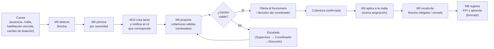
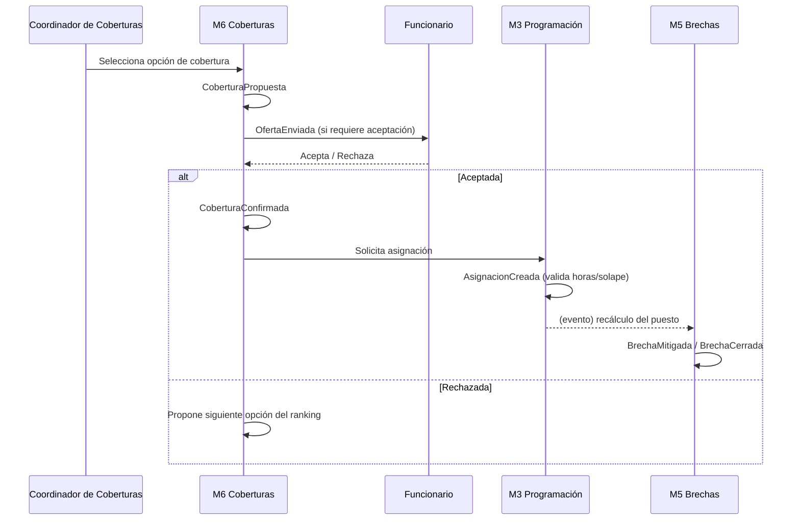

# 04 · Flujo central: de la brecha a la resolución

Este es **el flujo que da sentido a toda la plataforma**. Todos los módulos existen para hacerlo posible. Se compone de cinco fases: **Detectar → Priorizar → Proponer → Resolver → Aprender.**

## 4.1 Recorrido completo (visión de negocio)



## 4.2 Fase 1 — Detectar

La brecha **nunca se crea a mano**. Nace cuando ocurre una de sus causas y el motor (M5) recalcula el puesto afectado:

| Causa | Evento disparador | Efecto |
|-------|-------------------|--------|
| Se aprueba una ausencia | `AusenciaAprobada` (M4) | Retira oferta neta del puesto asignado. |
| Se edita/publica la malla | `AsignacionEliminada` / `MallaPublicada` (M3) | Cambia la oferta bruta. |
| Vence una habilitación | `HabilitacionVencida` (M2) | El asignado deja de ser oferta válida. |
| Cambia la dotación objetivo | `DotacionObjetivoActualizada` (M1) | Cambia la demanda. |
| Cambia un contrato (jornada) | `ContratoActualizado` (M1) | Puede reducir la capacidad disponible. |

M5 recalcula **solo el puesto afectado** (cálculo incremental, no toda la malla) y, si `Brecha > 0`, emite `BrechaDetectada`.

## 4.3 Fase 2 — Priorizar

M5 asigna una **severidad** a cada brecha:

```
Severidad = f(magnitud, criticidad_unidad, proximidad_temporal)
```

- **magnitud** = `Brecha / Demanda` (cuánto falta en proporción).
- **criticidad_unidad** = peso configurable por unidad (UCI/Urgencias altos).
- **proximidad_temporal** = decae con los días hasta el turno (hoy > mañana > próxima semana).

Resultado: cada brecha entra en la **cola priorizada de coberturas** con nivel `Crítica / Alta / Media / Baja`. La cola es una **vista derivada** siempre coherente (ver [05](./05-fuente-unica-de-verdad.md)).

## 4.4 Fase 3 — Proponer (candidatos válidos)

M6 genera opciones de cobertura, pero **solo las válidas**. El filtro de habilitación (M2) y de horas/contrato (M1) es una **restricción dura**: un candidato no habilitado o que superaría su tope de horas **no aparece**.

Opciones ordenadas por **menor costo e impacto** (jerarquía por defecto, configurable):

| # | Opción de cobertura | Costo/impacto típico |
|---|---------------------|----------------------|
| 1 | **Reasignación interna** (mover sobredotación de otra unidad) | Muy bajo · sin costo extra |
| 2 | **Pool / personal flotante** | Bajo · ya contratado para esto |
| 3 | **Cambio / permuta de turno** entre funcionarios | Bajo · requiere acuerdo mutuo |
| 4 | **Llamado voluntario** (disponibilidad ofrecida) | Medio · según incentivos |
| 5 | **Hora extra** de personal de la unidad | Alto · costo y fatiga |
| 6 | **Contratación externa / turno de refuerzo** | Muy alto · último recurso |

Cada opción muestra, **antes de confirmar**: costo estimado, impacto en horas del funcionario, y si deja alguna otra brecha al descubierto (evitar "robar" personal de un puesto crítico).

## 4.5 Fase 4 — Resolver



Si ninguna opción es viable, la brecha se **escala** siguiendo la cadena de responsabilidad (Supervisor → Coordinador → Dirección), notificada por M10.

## 4.6 Fase 5 — Aprender

Al cerrarse, M8 registra:
- **Tiempo de resolución** (detección → cierre).
- **Tipo de cobertura usada** y **costo real**.
- **Causa raíz** (ausentismo, subdotación estructural, vencimiento de habilitación…).

Con el histórico, M8 **anticipa**: predice picos de ausentismo, unidades con brecha crónica y competencias escasas. Esas señales retroalimentan a M1 (ajustar dotación objetivo), M7 (priorizar formación) y M6 (dimensionar el pool). El ciclo se cierra y **mejora solo**.

## 4.7 Quién hace qué en el flujo (por rol)

| Fase | Funcionario | Supervisor | Coord. Coberturas | Dirección | Admin |
|------|-------------|------------|-------------------|-----------|-------|
| Detectar | — (causa: solicita ausencia) | Ve brechas de su unidad | Ve brechas transversales | Ve panorama | Configura reglas |
| Priorizar | — | Revisa prioridad de su unidad | Gestiona la cola global | Ajusta criticidades | Define fórmula de severidad |
| Proponer | Ofrece disponibilidad | Propone coberturas internas | Propone/optimiza cross-unidad | — | Configura jerarquía de opciones |
| Resolver | Acepta/rechaza oferta | Confirma dentro de su unidad | Confirma y despacha el pool | Aprueba alto costo | — |
| Aprender | — | Ve KPIs de su unidad | Ve KPIs de cobertura | Ve KPIs estratégicos y costos | Administra tableros |

Ver navegación detallada en [06 · Roles y navegación](./06-roles-y-navegacion.md).
