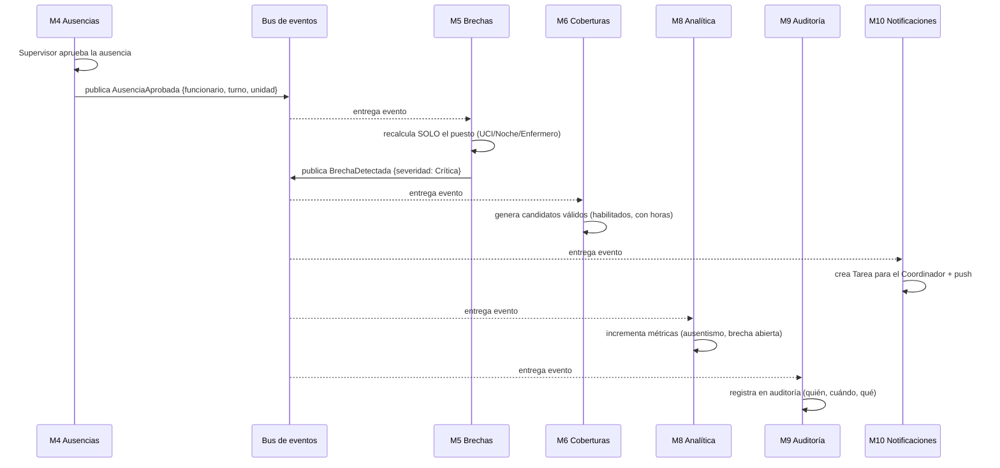
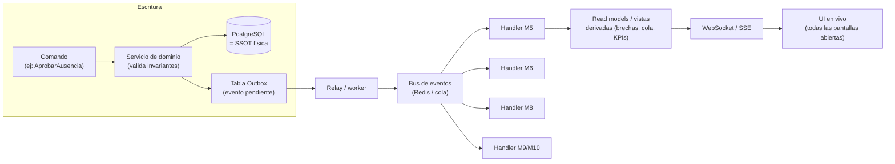

# 05 · Fuente única de verdad (SSOT) y reactividad

Este documento explica **el requisito más importante de NEX Shift**:

> *"Utiliza una única fuente de información: cualquier cambio debe actualizar automáticamente todos los módulos relacionados."*

Aquí se define **cómo** se cumple, de forma concreta y verificable.

## 5.1 Los dos pilares

1. **Un solo dueño por dato (SSOT estructural).** Cada entidad se escribe en **un único lugar**. Ningún módulo guarda una copia editable de un dato ajeno; lo **referencia** por su identificador. Ver tabla de dueños en [02 · Modelo de dominio](./02-modelo-de-dominio.md#22-entidades-y-su-dueño-ssot).

2. **Propagación por eventos (SSOT reactiva).** Cuando el dueño cambia un dato, **emite un evento de dominio**. Los módulos interesados reaccionan y recalculan lo suyo. Nadie "se olvida" de actualizarse porque nadie tiene que acordarse: el evento llega solo.

Juntos garantizan que **no exista información contradictoria** en el sistema: lo que no es dueño, o es una referencia, o es un cálculo reproducible.

## 5.2 Datos base vs. datos derivados

| Tipo | Ejemplos | Regla |
|------|----------|-------|
| **Base** (se editan) | Funcionario, Contrato, Asignación, Ausencia, Habilitación, Dotación objetivo | Tienen dueño; se escriben una sola vez; emiten eventos al cambiar. |
| **Derivado** (se calculan) | **Brecha**, cola de coberturas, KPIs, forecast, "disponibilidad neta" | **Nunca** se editan a mano. Son función de los datos base y siempre pueden reconstruirse. |

> Regla de oro: **si un dato se puede calcular, se calcula — no se guarda como verdad editable.** Esto hace imposible que una brecha quede "colgada" mostrando algo que ya no es cierto.

## 5.3 Anatomía de una propagación (ejemplo real)

**Escenario:** un enfermero de UCI pide licencia médica para el turno noche de mañana, y su supervisor la aprueba.

**Una sola acción del usuario** (aprobar la ausencia) actualizó: la disponibilidad, la brecha, la cola de coberturas, la tarea del coordinador, los KPIs y la auditoría — **sin ninguna intervención manual adicional**. Eso es la SSOT reactiva.

## 5.4 Cómo se implementa (técnico)

Componentes clave:

- **Servicio de dominio**: única puerta de escritura; valida las invariantes ([02 §2.5](./02-modelo-de-dominio.md#25-invariantes-del-dominio-reglas-que-siempre-se-cumplen)) antes de persistir.
- **Patrón Outbox**: el cambio de datos y el registro del evento se guardan en la **misma transacción**. Así, si se confirma el cambio, el evento *siempre* se publica (no se pierde ni se duplica). Garantía *at-least-once*.
- **Bus de eventos** (Redis Pub/Sub + colas BullMQ): entrega los eventos a los handlers de cada módulo.
- **Read models / vistas derivadas**: tablas o vistas materializadas para brechas, cola de coberturas y KPIs. Son **caché reconstruible**, no verdad.
- **WebSocket/SSE**: empuja los cambios a **todas las pantallas abiertas** para que la UI esté viva sin recargar.
- **Idempotencia**: cada handler tolera recibir el mismo evento dos veces (usa el id del evento) — necesario con entrega *at-least-once*.

## 5.5 Consistencia: qué es inmediato y qué es "casi inmediato"

- **Inmediato (síncrono):** las **invariantes duras** se validan en la misma transacción de escritura (no se puede crear una asignación que viole horas o habilitación). Nunca se persiste un estado inválido.
- **Casi inmediato (eventual, <1–2 s):** los **derivados** (brecha, cola, KPIs) se recalculan al procesar el evento. En la práctica es casi instantáneo, pero se diseña asumiendo un pequeño desfase — por eso los derivados son reconstruibles y las pantallas se actualizan por push.

Esta separación es deliberada: **la corrección se garantiza siempre; la visualización derivada converge en un instante.**

## 5.6 Reconstrucción y confianza

Como todo derivado es función de los datos base + el log de eventos:

- Se puede **recalcular cualquier brecha o KPI desde cero** en cualquier momento (útil para migraciones, corrección de bugs o auditorías).
- El **log de eventos** (append-only) es la memoria del sistema: permite responder "¿por qué esta brecha existió y cómo se resolvió?" con precisión.
- No hay "verdad guardada a mano" que pueda contradecir a los datos: si algo se ve raro, se recalcula.

## 5.7 Checklist de cumplimiento SSOT (para cada nuevo módulo/feature)

Al construir cualquier funcionalidad nueva, debe cumplir:

- [ ] ¿Este dato ya tiene dueño? Si sí, lo **referencio**, no lo copio.
- [ ] Si es nuevo, ¿declaré su módulo dueño y su ciclo de vida?
- [ ] ¿Se puede **calcular** en vez de guardar? Si sí, es derivado (no editable).
- [ ] Cada cambio de estado, ¿emite un **evento de dominio** por Outbox?
- [ ] ¿El handler que reacciona es **idempotente**?
- [ ] ¿El cambio queda en **auditoría** (M9)?
- [ ] ¿La UI afectada se actualiza por **push**, sin recargar?
