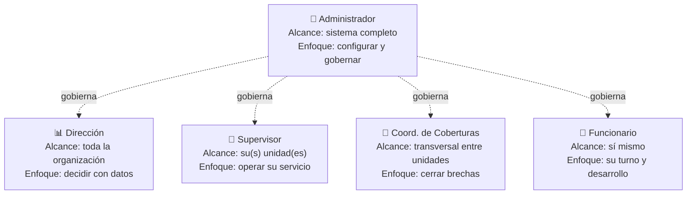
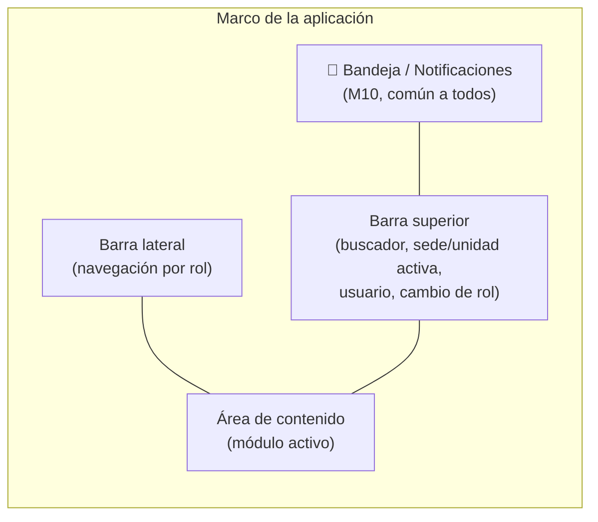

# 06 · Roles y navegación

La seguridad de NEX Shift es **RBAC (control de acceso basado en roles)**: lo que un usuario ve y puede hacer depende de su **perfil**, no de la pantalla. Un mismo módulo (p. ej. Coberturas) se muestra distinto para un Funcionario y para un Coordinador.

## 6.1 Los 5 perfiles y su alcance



| Perfil | Alcance de datos | Pregunta que responde su pantalla de inicio |
|--------|------------------|---------------------------------------------|
| **Administrador** | Todo el sistema | "¿Está todo bien configurado, seguro y operativo?" |
| **Dirección** | Toda la organización (agregado) | "¿Cómo está la dotación y cuánto nos cuesta?" |
| **Supervisor** | Su(s) unidad(es) | "¿Cómo está la dotación de mi servicio hoy y esta semana?" |
| **Coordinador de Coberturas** | Transversal (todas las unidades, foco brechas) | "¿Qué brechas hay abiertas y cómo las cierro ya?" |
| **Funcionario** | Solo sus propios datos | "¿Cuándo trabajo, qué tengo pendiente y cómo crezco?" |

## 6.2 Matriz de permisos por módulo

Leyenda: **C**=Crear · **L**=Leer · **E**=Editar · **A**=Aprobar · **—**=sin acceso · *(propio)*=solo sus datos

| Módulo | Administrador | Dirección | Supervisor | Coord. Coberturas | Funcionario |
|--------|:---:|:---:|:---:|:---:|:---:|
| M1 Personal y Organización | C L E | L | L E *(su unidad)* | L | L *(propio)* |
| M2 Habilitación y Competencias | C L E | L | L E *(su unidad)* | L | L *(propio)* |
| M3 Programación (Malla) | C L E | L | C L E A *(su unidad)* | L E *(vía cobertura)* | L *(propio)* |
| M4 Ausencias | C L E A | L | L A *(su unidad)* | L | C L *(propio)* |
| M5 Detección de Brechas | L (config) | L | L *(su unidad)* | L *(todas)* | — |
| M6 Coberturas | C L E | L | C L E *(su unidad)* | C L E A *(todas)* | L + Aceptar *(propio)* |
| M7 Desarrollo Profesional | C L E | L | L E *(su equipo)* | L | L E *(propio)* |
| M8 Analítica e Inteligencia | C L E | L *(estratégica)* | L *(su unidad)* | L *(coberturas)* | — |
| M9 Administración y Seguridad | C L E A | L *(auditoría)* | — | — | — |
| M10 Notificaciones y Bandeja | C L E | L *(propio)* | L *(propio)* | L *(propio)* | L *(propio)* |

> La matriz es la **fuente de verdad de los permisos**. Las pantallas se derivan de ella (si un permiso es `—`, la opción no aparece en el menú de ese rol).

## 6.3 Navegación por perfil

Cada perfil tiene una navegación adaptada. Aquí se define **la estructura del menú y el foco**, no las pantallas (esas vienen después).

### 👑 Administrador
```
Inicio (salud del sistema)
├── Organización        → sedes, unidades, roles clínicos, dotación objetivo
├── Personal            → funcionarios, contratos
├── Competencias        → catálogo, requisitos por puesto
├── Configuración
│   ├── Turnos y calendarios
│   ├── Reglas de severidad de brechas
│   ├── Jerarquía de opciones de cobertura
│   └── Integraciones (nómina, RRHH, marcaje)
├── Seguridad           → usuarios, roles, permisos
└── Auditoría           → registro de eventos
```

### 📊 Dirección
```
Inicio (tablero estratégico: dotación, cobertura, costo)
├── Panorama de dotación   → por sede/unidad, cobertura vs objetivo
├── Brechas                → tendencias, unidades con brecha crónica
├── Costos de cobertura    → horas extra, contratación externa
├── Talento                → capacidad, competencias escasas, forecast
└── Aprobaciones           → coberturas/decisiones de alto impacto
```

### 🏥 Supervisor
```
Inicio (estado de mi unidad hoy y semana)
├── Mi malla               → programación de la unidad, publicar
├── Mi dotación            → funcionarios, habilitaciones, vencimientos
├── Ausencias              → bandeja de aprobación de mi equipo
├── Brechas de mi unidad   → detectadas, prioridad
├── Coberturas             → resolver dentro de mi unidad / escalar
└── Mi equipo              → desarrollo y competencias del personal
```

### 🔀 Coordinador de Coberturas
```
Inicio (cola de brechas priorizada, todas las unidades)
├── Cola de brechas        → severidad, filtros por unidad/turno/fecha
├── Resolver               → candidatos válidos, comparar costo/impacto
├── Pool / Flotante        → disponibilidad, despacho
├── Disponibilidad ofrecida→ quién se ofreció a cubrir
├── Escaladas              → brechas sin solución viable
└── Analítica de cobertura → tiempo de resolución, mix de opciones
```

### 👤 Funcionario
```
Inicio (mi próximo turno + tareas pendientes)
├── Mi calendario          → mis turnos, publicado
├── Mis ausencias          → solicitar, ver estado
├── Ofrecer disponibilidad → ventanas para cubrir brechas
├── Mis ofertas            → coberturas ofrecidas a mí (aceptar/rechazar)
├── Mi desarrollo          → plan, formación, competencias
└── Mi perfil              → datos, habilitaciones y vencimientos
```

## 6.4 Estructura común a todos (marco de la app)

Independiente del rol, la aplicación comparte un **marco**:



- La **bandeja de tareas (M10)** es transversal: es donde "aterrizan" las brechas, aprobaciones y ofertas dirigidas a cada rol.
- El **selector de contexto** (sede/unidad activa) filtra todo lo que se muestra, respetando el alcance del rol.
- Un usuario puede tener **más de un rol** (p. ej. Supervisor que también es Funcionario); el marco permite **cambiar de perfil** sin cerrar sesión.

## 6.5 Reglas de seguridad

1. Los permisos se evalúan **en el backend** en cada operación (no basta con ocultar el botón).
2. El **alcance de datos** (row-level) se aplica siempre: un Supervisor solo consulta funcionarios/brechas de su unidad, aunque manipule la URL.
3. Las **excepciones** (p. ej. asignar a alguien no habilitado por urgencia) requieren permiso especial y quedan **auditadas** con justificación.
4. El cambio de rol o de alcance queda registrado en **auditoría (M9)**.
