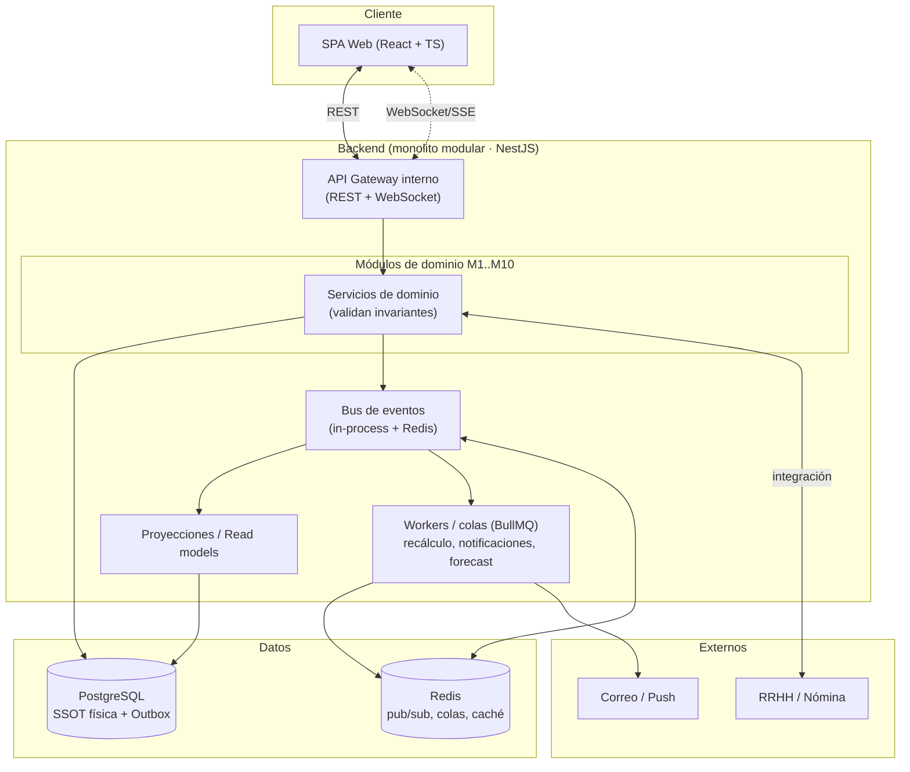

# 07 · Arquitectura técnica

Este documento define **con qué y cómo** se construye NEX Shift. Las elecciones son **recomendaciones fundamentadas**; pueden ajustarse antes de empezar a codificar, pero el patrón general (monolito modular, reactivo por eventos, SSOT) es el que sostiene los requisitos funcionales.

## 7.1 Estilo arquitectónico: monolito modular reactivo

- **Monolito modular**, no microservicios (todavía). Los 10 módulos viven en un mismo despliegue pero con **fronteras estrictas**: cada uno tiene su propio dominio, servicios y esquema lógico, y solo se comunican por **eventos** y **APIs internas**.
- **Por qué:** permite construir **paso a paso** (el objetivo del proyecto) sin la complejidad operativa de N servicios; y como las fronteras y los eventos ya están definidos, **cualquier módulo puede extraerse a un servicio propio** más adelante sin reescribir el dominio.



## 7.2 Capas dentro de cada módulo

Cada módulo sigue una arquitectura en capas (inspirada en *hexagonal / clean architecture*):

```
┌─────────────────────────────────────────────┐
│ Interfaz (controllers REST / WS / handlers)  │  ← entra/sale del módulo
├─────────────────────────────────────────────┤
│ Aplicación (casos de uso / comandos·queries) │  ← orquesta, no tiene reglas
├─────────────────────────────────────────────┤
│ Dominio (entidades, invariantes, eventos)    │  ← el corazón, sin dependencias
├─────────────────────────────────────────────┤
│ Infraestructura (repos, ORM, bus, externos)  │  ← detalles reemplazables
└─────────────────────────────────────────────┘
```

- El **dominio no conoce** la base de datos ni el framework → testeable y estable.
- Los **casos de uso** se separan en **comandos** (escriben, emiten eventos) y **queries** (leen read models). Es un CQRS ligero, alineado con la separación base/derivado de la [SSOT](./05-fuente-unica-de-verdad.md).

## 7.3 Stack recomendado

| Capa | Tecnología | Motivo |
|------|-----------|--------|
| **Frontend** | React 18 + TypeScript + Vite | Estándar maduro, tipado, build rápido. |
| Estado servidor | TanStack Query | Cache + sincronización con el backend; encaja con read models. |
| Estado UI | Zustand | Ligero para estado local (selector de contexto, filtros). |
| Tiempo real | WebSocket (socket.io) o SSE | Empuja cambios de brechas/coberturas a la UI viva. |
| UI / estilos | Tailwind CSS + componentes (shadcn/ui) | Rápido, consistente, accesible. |
| Gráficos | Recharts / visx | Tableros de M8. |
| **Backend** | Node.js + TypeScript + **NestJS** | DI y módulos de primera clase → fronteras limpias, ideal para monolito modular. |
| ORM | Prisma | Tipado, migraciones, buen DX. |
| **Base de datos** | **PostgreSQL** | SSOT física; transacciones fuertes, vistas materializadas, JSONB. |
| Caché / colas / pub-sub | **Redis** + BullMQ | Bus de eventos, colas de recálculo/notificación, caché de read models. |
| Autenticación | JWT + refresh; OIDC opcional | Sesiones seguras; integrable con IdP institucional. |
| Autorización | RBAC + row-level scoping | Ver [06 · Roles](./06-roles-y-navegacion.md). |
| Validación | Zod (compartida front/back) | Un solo esquema de validación en ambos lados. |
| **Infra** | Monorepo (pnpm workspaces) + Docker | Front y back juntos, tipos compartidos, despliegue reproducible. |
| Observabilidad | OpenTelemetry + logs estructurados | Trazar el flujo de eventos end-to-end. |
| Testing | Vitest + Playwright | Unit/integración + E2E del flujo brecha→resolución. |

### Tipos compartidos
El monorepo incluye un paquete `packages/contracts` con los **tipos de entidades, DTOs y eventos** en TypeScript + Zod, usados por **front y back**. Así, el contrato de un evento (`AbsenceApproved`) es **uno solo** para todo el sistema — coherente con la SSOT también a nivel de código.

## 7.4 Organización del monorepo

```
nex-shift/
├── apps/
│   ├── web/                 # SPA React (frontend)
│   └── api/                 # Backend NestJS (monolito modular)
│       └── src/modules/
│           ├── personal/          # M1
│           ├── habilitacion/      # M2
│           ├── programacion/      # M3
│           ├── ausencias/         # M4
│           ├── brechas/           # M5 (motor)
│           ├── coberturas/        # M6
│           ├── desarrollo/        # M7
│           ├── analitica/         # M8
│           ├── admin/             # M9
│           └── notificaciones/    # M10
├── packages/
│   ├── contracts/           # tipos + Zod + catálogo de eventos (compartido)
│   ├── ui/                  # componentes de UI compartidos
│   └── config/              # ESLint, TS, Tailwind base
├── docs/architecture/       # esta documentación
└── infra/                   # Docker, migraciones, seeds
```

Cada carpeta de módulo replica las **capas** de §7.2. Un módulo **no importa** el código interno de otro: solo `contracts` (tipos/eventos) y APIs públicas.

## 7.5 Motor de brechas (M5) — nota de diseño

Es el componente con más exigencia de correctitud y rendimiento:

- **Cálculo incremental:** ante un evento, recalcula **solo los puestos afectados** (por unidad/turno/fecha/rol), no toda la malla.
- **Idempotente y reconstruible:** puede recomputar cualquier rango desde cero (job de "reconciliación" nocturno que verifica que los read models coinciden con el recálculo íntegro).
- **Read model `gap_board`:** tabla proyectada con la cola priorizada, indexada por unidad, severidad y fecha, servida a la UI y empujada por WebSocket.

## 7.6 Integraciones externas

Se integran como **fuentes/consumidores en la frontera**, nunca acoplando el dominio:

| Sistema | Dirección | Uso |
|---------|-----------|-----|
| RRHH / maestro de personal | Entrada | Sincroniza funcionarios y contratos (M1). |
| Nómina | Salida | Exporta horas/coberturas para pago (no se calcula aquí). |
| Marcaje / asistencia | Entrada | Confirma presencia real vs. programado (alimenta M8). |
| Identidad (OIDC/LDAP) | Entrada | Autenticación institucional (M9). |
| Correo / Push | Salida | Notificaciones (M10). |

Todas pasan por **adaptadores** con su propio contrato; si una integración falla, el núcleo sigue operando.

## 7.7 No funcionales (objetivos)

| Atributo | Objetivo |
|----------|----------|
| Latencia UI (lectura) | < 300 ms en vistas de brechas/malla. |
| Propagación de un cambio a derivados | < 2 s (p95). |
| Disponibilidad | 99.9% (operación clínica). |
| Auditabilidad | 100% de cambios de estado trazados (append-only). |
| Seguridad | RBAC + row-level + cifrado en tránsito y reposo; datos personales protegidos. |
| Escalabilidad | Workers de recálculo/notificación escalan horizontalmente vía colas. |
