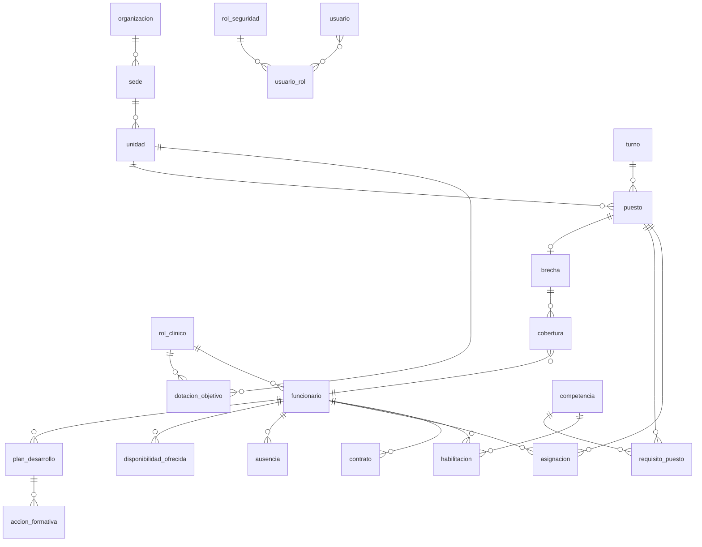

# 08 · Modelo de datos (SSOT física)

Este es el **esquema lógico** que materializa la fuente única de verdad en PostgreSQL. Cada tabla base tiene **un módulo dueño**; las tablas derivadas se marcan como tales y **no se editan a mano**.

> Convenciones: `id` = UUID · `*_at` = timestamptz · `_ref` = clave foránea (referencia, no copia) · **(D)** = tabla derivada (calculada, reconstruible).

## 8.1 Diagrama entidad-relación (físico)



## 8.2 Tablas por módulo

### M1 · Personal y Organización
```
organizacion(id, nombre, creado_at)
sede(id, organizacion_ref, nombre, direccion)
unidad(id, sede_ref, nombre, tipo, criticidad, activa)          -- criticidad alimenta severidad
rol_clinico(id, nombre, descripcion)                             -- Enfermero/a, TENS, Médico/a...
funcionario(id, rut_o_id, nombre, apellidos, rol_clinico_ref, unidad_base_ref, estado)
contrato(id, funcionario_ref, tipo, fte, horas_max_periodo, vigencia_desde, vigencia_hasta)
dotacion_objetivo(id, unidad_ref, turno_ref, rol_clinico_ref, cantidad, vigencia_desde, vigencia_hasta)
```

### M2 · Habilitación y Competencias
```
competencia(id, nombre, categoria, descripcion)
requisito_puesto(id, unidad_ref, rol_clinico_ref, competencia_ref, obligatoria)  -- qué exige un puesto
habilitacion(id, funcionario_ref, competencia_ref, unidad_ref, estado, vigencia_desde, vigencia_hasta, fuente)
    -- estado: Vigente | PorVencer | Vencida | Renovada
    -- fuente: acreditacion externa | accion_formativa_ref (M7)
```

### M3 · Programación
```
turno(id, nombre, hora_inicio, hora_fin, cruza_medianoche)      -- Mañana, Tarde, Noche...
puesto(id, unidad_ref, turno_ref, fecha, rol_clinico_ref, cantidad_requerida)
    -- 'puesto' = instancia concreta de demanda; se compara contra asignaciones
asignacion(id, puesto_ref, funcionario_ref, origen, estado, creado_por, creado_at)
    -- origen: malla | cobertura_ref (M6)
    -- estado: Planificada | Confirmada | Anulada
malla_publicacion(id, unidad_ref, periodo_desde, periodo_hasta, publicada_at, publicada_por)
```

### M4 · Ausencias
```
tipo_ausencia(id, nombre, requiere_aprobacion, afecta_disponibilidad)  -- Vacaciones, Lic. médica, Permiso, Formación
ausencia(id, funcionario_ref, tipo_ref, desde, hasta, estado, motivo, solicitada_at, resuelta_por, resuelta_at)
    -- estado: Solicitada | EnRevision | Aprobada | Rechazada | Anulada
```

### M5 · Detección de Brechas  **(D)**
```
brecha(id, puesto_ref, demanda, oferta_neta, deficit, severidad, nivel, estado, detectada_at, cerrada_at)  (D)
    -- deficit = demanda - oferta_neta ; nivel: Critica|Alta|Media|Baja
    -- estado: Detectada|Priorizada|EnGestion|Resuelta|Cerrada|Escalada|Desestimada
gap_board(unidad_ref, fecha, turno_ref, rol_clinico_ref, nivel, deficit, brecha_ref, ...)  (D)  -- read model de la cola
regla_severidad(id, factor_magnitud, factor_criticidad, factor_proximidad, umbral_por_vencer_dias)  -- config (M9/Admin)
```

### M6 · Coberturas
```
pool(id, nombre, alcance, unidad_ref?)                          -- flotante transversal o por unidad
pool_miembro(pool_ref, funcionario_ref)
disponibilidad_ofrecida(id, funcionario_ref, desde, hasta, tipo, creada_at)  -- ventanas para cubrir
cobertura(id, brecha_ref, tipo, funcionario_ref, costo_estimado, costo_real, estado, propuesta_at, confirmada_at, decidida_por)
    -- tipo: Reasignacion|Pool|CambioTurno|Voluntario|HoraExtra|Externa
    -- estado: Propuesta|OfertaEnviada|Aceptada|Confirmada|Rechazada|Anulada|Cerrada
```

### M7 · Desarrollo Profesional
```
plan_desarrollo(id, funcionario_ref, objetivo, estado, creado_at)
accion_formativa(id, plan_ref, nombre, competencia_objetivo_ref, estado, completada_at)
    -- al completarse → habilita a M2 a otorgar 'habilitacion'
ruta_carrera(id, rol_origen_ref, rol_destino_ref, competencias_requeridas)
```

### M8 · Analítica  **(D)**
```
kpi_definicion(id, clave, nombre, formula, unidad_medida)       -- config
kpi_valor(id, kpi_ref, alcance, periodo, valor, calculado_at)   (D)
forecast(id, unidad_ref, rol_clinico_ref, periodo, demanda_prevista, ausentismo_previsto, generado_at)  (D)
tablero_guardado(id, usuario_ref, definicion_json)
```

### M9 · Administración y Seguridad
```
usuario(id, funcionario_ref?, email, hash_password?, idp_sub?, estado, ultimo_acceso_at)
rol_seguridad(id, clave, nombre)                                -- Administrador, Direccion, Supervisor, Coordinador, Funcionario
permiso(id, rol_ref, modulo, accion, alcance)                   -- materializa la matriz de [06]
usuario_rol(usuario_ref, rol_ref, unidad_alcance_ref?)          -- un usuario puede tener varios roles
configuracion(id, clave, valor_json, actualizada_por, actualizada_at)
auditoria(id, actor_usuario_ref, evento, entidad, entidad_id, datos_json, ocurrido_at)  -- append-only
outbox(id, tipo_evento, payload_json, ocurrido_at, publicado_at?)  -- patrón Outbox (SSOT reactiva)
```

### M10 · Notificaciones y Bandeja
```
notificacion(id, usuario_ref, tipo, titulo, cuerpo, entidad_ref, leida, creada_at)
tarea(id, usuario_ref, tipo, entidad_ref, estado, prioridad, vence_at, creada_at)  -- brecha/aprobación/oferta accionable
preferencia_notificacion(usuario_ref, canal, tipo_evento, activo)
```

## 8.3 Cómo el esquema garantiza la SSOT

1. **Sin duplicación:** los datos ajenos se guardan como `_ref` (FK), nunca como copia. P. ej. `cobertura.funcionario_ref` apunta al único `funcionario`.
2. **Derivados marcados (D):** `brecha`, `gap_board`, `kpi_valor`, `forecast` se **recalculan**; existen restricciones que impiden su edición manual (solo el motor/worker escribe en ellas).
3. **Outbox transaccional:** toda escritura de dominio inserta su evento en `outbox` **en la misma transacción**, garantizando la propagación (ver [05 §5.4](./05-fuente-unica-de-verdad.md#54-cómo-se-implementa-técnico)).
4. **Auditoría append-only:** `auditoria` nunca se actualiza ni borra; es la memoria del sistema.
5. **Integridad temporal:** índices únicos evitan asignaciones solapadas del mismo funcionario y dotaciones objetivo contradictorias en un mismo período.

## 8.4 Índices y vistas clave (rendimiento del motor)

- `puesto(unidad_ref, fecha, turno_ref, rol_clinico_ref)` — recálculo incremental de brechas.
- `asignacion(funcionario_ref, fecha)` — detección de solapamientos y control de horas.
- `habilitacion(funcionario_ref, competencia_ref, estado, vigencia_hasta)` — filtro de candidatos válidos y alertas de vencimiento.
- Vista materializada `gap_board` — cola priorizada servida a la UI; refrescada por evento.
- `outbox(publicado_at)` parcial `WHERE publicado_at IS NULL` — el relay procesa solo lo pendiente.
