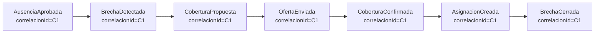

# 09 · Catálogo de eventos de dominio

Los **eventos de dominio** son el mecanismo que hace reactivo al sistema y cumple la SSOT: cuando el dueño de un dato lo cambia, **emite un evento** y los módulos interesados **reaccionan**. Este documento es el **contrato** de esos eventos.

## 9.1 Anatomía de un evento

Todos los eventos comparten una envoltura común (definida en `packages/contracts`):

```ts
type DomainEvent<TPayload> = {
  id: string;            // UUID único → idempotencia
  tipo: string;          // p.ej. "AusenciaAprobada"
  version: number;       // versión del esquema del evento
  ocurridoAt: string;    // timestamptz ISO
  actor: string;         // usuario o sistema que lo originó
  agregado: {            // a qué entidad se refiere
    tipo: string;        // "Ausencia"
    id: string;
  };
  payload: TPayload;     // datos específicos del evento
  correlacionId?: string // para trazar una cadena (brecha → cobertura)
};
```

Reglas:
- **Nombre en pasado** (algo que **ya ocurrió**): `AsignacionCreada`, no `CrearAsignacion`.
- **Inmutable**: un evento nunca se edita; si algo cambia, se emite uno nuevo.
- **Idempotente en consumo**: los handlers usan `id` para no procesar dos veces (entrega *at-least-once*).
- **Versionado**: cambios de esquema incrementan `version` sin romper consumidores.

## 9.2 Catálogo por módulo emisor

| Evento | Emite (módulo) | Payload principal | Reaccionan | Efecto en la SSOT |
|--------|:--:|-------------------|-----------|-------------------|
| `FuncionarioCreado` | M1 | funcionario, rol, unidad base | M2, M9 | Alta de candidato potencial. |
| `ContratoActualizado` | M1 | funcionario, fte, horas_max | M3, M5 | Cambia capacidad → posible recálculo. |
| `DotacionObjetivoActualizada` | M1 | unidad, turno, rol, cantidad | **M5** | Cambia la **demanda** → recalcula brechas. |
| `UnidadActualizada` | M1 | unidad, criticidad | M5, M8 | Afecta severidad. |
| `HabilitacionOtorgada` | M2 | funcionario, competencia, unidad | M6, M5 | Amplía candidatos válidos. |
| `HabilitacionPorVencer` | M2 | funcionario, competencia, fecha | M10, M7 | Alerta + posible acción formativa. |
| `HabilitacionVencida` | M2 | funcionario, competencia | **M5**, M3, M10 | Retira oferta válida → **puede abrir brecha**. |
| `HabilitacionRenovada` | M2 | funcionario, competencia | M5, M6 | Restaura candidato. |
| `AsignacionCreada` | M3 | puesto, funcionario, origen | **M5**, M8 | Aumenta oferta → **mitiga/cierra brecha**. |
| `AsignacionModificada` | M3 | puesto, funcionario | M5 | Recalcula puesto. |
| `AsignacionEliminada` | M3 | puesto, funcionario | **M5** | Reduce oferta → **puede abrir brecha**. |
| `MallaPublicada` | M3 | unidad, período | M5, M10, M8 | Recalcula brechas del período; notifica. |
| `AusenciaSolicitada` | M4 | funcionario, tipo, rango | M10 | Tarea de aprobación al Supervisor. |
| `AusenciaAprobada` | M4 | funcionario, rango, turnos | **M5**, M8, M10 | Retira oferta neta → **abre brecha**. |
| `AusenciaRechazada` | M4 | funcionario, rango | M5 | Si había brecha por previsión, la **desestima**. |
| `AusenciaAnulada` | M4 | funcionario, rango | M5 | Restaura oferta → puede cerrar brecha. |
| `BrechaDetectada` | **M5** | puesto, deficit, severidad | **M6**, M10, M8, M9 | Entra a la cola; crea tarea al Coordinador. |
| `BrechaAgravada` | M5 | brecha, nueva severidad | M6, M10 | Re-prioriza. |
| `BrechaMitigada` | M5 | brecha, deficit restante | M6, M8 | Actualiza cola. |
| `BrechaCerrada` | M5 | brecha, tiempo_resolucion | M8, M10 | KPI de resolución. |
| `BrechaDesestimada` | M5 | brecha, causa | M6, M10 | Sale de la cola (causa desapareció). |
| `CoberturaPropuesta` | M6 | brecha, opciones | M10 | Registra intento. |
| `OfertaEnviada` | M6 | cobertura, funcionario | M10 | Oferta al Funcionario (aceptar/rechazar). |
| `CoberturaAceptada` | M6 | cobertura, funcionario | M6 | Avanza a confirmación. |
| `CoberturaConfirmada` | M6 | cobertura, puesto, funcionario | **M3**, M8, M9 | **Crea asignación** → cierra la brecha. |
| `CoberturaAnulada` | M6 | cobertura | M3, M5 | Revierte asignación → reabre brecha. |
| `AccionFormativaCompletada` | M7 | funcionario, competencia | **M2** | Habilita a **otorgar habilitación** → más capacidad. |
| `ForecastActualizado` | M8 | unidad, período, demanda prevista | M1, M6, M10 | Sugiere ajustar dotación/pool. |
| `AlertaDeTendencia` | M8 | métrica, unidad, señal | M10, Dirección | Aviso estratégico. |
| `UsuarioCreado` / `RolAsignado` | M9 | usuario, rol, alcance | M10 | Acceso y bienvenida. |
| `ConfiguracionCambiada` | M9 | clave, valor | módulo afectado | P. ej. cambiar regla de severidad → M5 recalibra. |

*(Toda emisión pasa además por M9 auditoría y puede generar notificaciones/tareas en M10 — no se repite en cada fila.)*

## 9.3 Cadenas de eventos (correlación)

Los eventos se encadenan mediante `correlacionId`, permitiendo reconstruir una historia completa:



Con `correlacionId=C1` se puede responder con exactitud: *"Esta ausencia generó esta brecha, que se cubrió con hora extra de tal funcionario en X minutos"* — trazabilidad de punta a punta ([05 §5.6](./05-fuente-unica-de-verdad.md#56-reconstrucción-y-confianza)).

## 9.4 Garantías de entrega

| Garantía | Cómo se logra |
|----------|---------------|
| **No se pierde ningún evento** | Patrón Outbox: evento y cambio en la misma transacción. |
| **Se entrega al menos una vez** | El relay reintenta hasta confirmar publicación. |
| **No se procesa dos veces** | Handlers idempotentes por `id` de evento. |
| **Orden por agregado** | Los eventos del mismo agregado se procesan en orden (clave de partición = `agregado.id`). |
| **Reprocesable** | El log de eventos permite reconstruir read models desde cero. |

## 9.5 Cómo añadir un evento nuevo (guía)

1. Definir el tipo y su `payload` en `packages/contracts` (fuente única del contrato).
2. Emitirlo **solo** desde el servicio de dominio dueño, vía Outbox.
3. Declarar qué módulos reaccionan y con qué efecto (añadir fila a §9.2).
4. Implementar handlers **idempotentes**.
5. Verificar el [checklist SSOT](./05-fuente-unica-de-verdad.md#57-checklist-de-cumplimiento-ssot-para-cada-nuevo-módulofeature).
