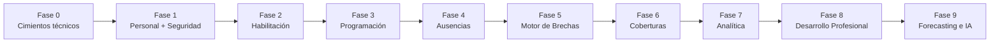

# 10 · Roadmap de construcción

Construiremos NEX Shift **paso a paso**, respetando las dependencias entre módulos ([03 §3.1](./03-modulos-funcionales.md#31-mapa-de-módulos-y-dependencias)). Cada fase deja el sistema **funcionando de punta a punta** para un subconjunto del flujo, no módulos "a medias".

## 10.1 Principio de secuenciación

> Primero los **cimientos** (quién trabaja y qué puede hacer), luego el **latido** (malla → ausencias → brecha → cobertura), y por último la **inteligencia** (talento y analítica). Lo transversal (seguridad, notificaciones) se incorpora desde el inicio en su forma mínima y crece con el sistema.

## 10.2 Fases

### Fase 0 · Cimientos técnicos *(sin pantallas de negocio)*
- Monorepo, apps `web` y `api`, paquete `contracts`.
- PostgreSQL + Prisma + migraciones; Redis; bus de eventos + **patrón Outbox**.
- Esqueleto de módulo (capas de [07 §7.2](./07-arquitectura-tecnica.md#72-capas-dentro-de-cada-módulo)) replicable.
- Autenticación básica y marco de la app (layout, navegación vacía).
- **Resultado:** infraestructura reactiva lista; se puede emitir y consumir un evento de prueba end-to-end.

### Fase 1 · Personal y Organización (M1) + Seguridad mínima (M9)
- Organización, sedes, unidades, roles clínicos, funcionarios, contratos, dotación objetivo.
- Usuarios, roles de seguridad y **RBAC** con la matriz de [06](./06-roles-y-navegacion.md).
- **Resultado:** existe la estructura y las personas; cada perfil entra y ve su marco.

### Fase 2 · Habilitación y Competencias (M2)
- Catálogo de competencias, requisitos por puesto, habilitaciones con vigencia.
- Alertas de `HabilitacionPorVencer` / `HabilitacionVencida`.
- **Resultado:** el sistema ya sabe **quién puede trabajar dónde**.

### Fase 3 · Programación (M3)
- Turnos, generación/edición de malla, puestos y asignaciones.
- Validación de invariantes (solapamiento, topes de horas, habilitación).
- **Resultado:** se arma la "oferta"; publicar la malla emite eventos.

### Fase 4 · Ausencias (M4)
- Tipos de ausencia, solicitud y flujo de aprobación; bandeja del Supervisor (M10 mínimo).
- **Resultado:** aparece la principal **causa de brechas** con su impacto en disponibilidad.

### Fase 5 · Motor de Detección de Brechas (M5) ⭐
- Cálculo incremental demanda vs oferta neta; severidad y priorización.
- Read model `gap_board` + push por WebSocket.
- **Resultado:** las brechas **se detectan solas** y llegan a la pantalla en vivo. *(Primer gran hito visible del valor de la plataforma.)*

### Fase 6 · Coberturas (M6) ⭐
- Generación de candidatos válidos, ranking por costo/impacto, ofertas, confirmación → asignación.
- Pool/flotante y disponibilidad ofrecida.
- **Resultado:** el flujo **brecha → resolución** está cerrado de punta a punta. *(Hito principal: la promesa central del producto funciona.)*

### Fase 7 · Analítica e Inteligencia (M8)
- KPIs (cobertura, ausentismo, tiempo de resolución, costo), tableros por rol.
- **Resultado:** Dirección y Coordinación deciden con datos reales del sistema.

### Fase 8 · Desarrollo Profesional (M7)
- Planes, acciones formativas, rutas de carrera; conexión formación → habilitación.
- **Resultado:** se cierra el ciclo de **capacidad futura**; formar amplía el pool de cobertura.

### Fase 9 · Forecasting e inteligencia predictiva
- Predicción de demanda y ausentismo; detección de brecha crónica y competencias escasas.
- Retroalimentación a dotación objetivo, pool y prioridades de formación.
- **Resultado:** el sistema **anticipa** brechas antes de que ocurran.

## 10.3 Qué sigue inmediatamente después de este diseño

1. **Validar esta arquitectura** contigo (ajustar módulos, roles, stack o alcance si hace falta).
2. **Fase 0**: inicializar el monorepo y la infraestructura reactiva (contracts + Outbox + bus).
3. Recién entonces, **empezar a construir pantallas** — comenzando por el marco de la app y M1, siempre sobre la SSOT ya definida.

> Este documento y el resto de `docs/architecture/` son la **base viva**: se actualizan a medida que el sistema evoluciona, manteniendo la coherencia entre lo diseñado y lo construido.
