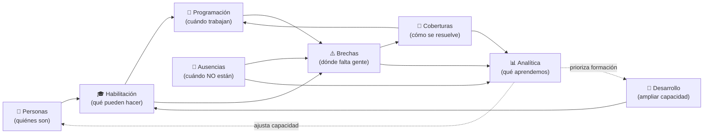

# 11 · Marco de la aplicación y experiencia integral

> **Enfoque:** este documento describe **el producto y la experiencia**, no la tecnología. Define el marco completo de la aplicación, cómo se relacionan los módulos desde el punto de vista del usuario y el **recorrido maestro** de principio a fin. La arquitectura técnica ([07](./07-arquitectura-tecnica.md)) se adapta a esto, no al revés.
>
> Acompaña a este documento un **mapa interactivo de validación** (artefacto) que permite recorrer el marco, el mapa de módulos y el recorrido maestro visualmente.

## 11.1 Filosofía de experiencia

Tres ideas gobiernan toda la experiencia de NEX Shift:

1. **El sistema te trae el trabajo; no vas a buscarlo.** La plataforma está orientada a **tareas**, no a "entrar a una pantalla a revisar". Cuando aparece una brecha, una aprobación pendiente o una oferta de cobertura, **aterriza en el centro de trabajo del usuario correcto**. El usuario resuelve desde ahí.

2. **Todo orbita alrededor de la brecha.** La pregunta permanente del producto es *"¿dónde falta dotación y cómo lo resuelvo?"*. Cada módulo existe para **prevenir, detectar o cerrar** una brecha. La experiencia guía siempre de la **señal** (algo cambió) a la **acción** (resolverlo).

3. **Una sola verdad, viva.** El usuario nunca ve datos contradictorios ni tiene que "refrescar". Cuando algo cambia en un lugar, **se actualiza en todos** al instante. La coherencia no es una tarea del usuario: es una propiedad del sistema.

## 11.2 El marco de la aplicación (app shell)

Independientemente del módulo o del rol, la aplicación comparte un **marco permanente** compuesto por seis regiones. Este marco es lo primero que construiremos, porque es el contenedor de todo lo demás.

```
┌───────────────────────────────────────────────────────────────────────┐
│ (A) BARRA DE CONTEXTO   Organización · Sede · Unidad activa · Rol · 🔎  │
├───────────┬───────────────────────────────────────────┬───────────────┤
│           │                                           │               │
│ (B)       │ (D) ESPACIO DE TRABAJO                     │ (E) PANEL DE  │
│ NAV       │     (el módulo activo)                     │  ACCIÓN       │
│ PRIMARIA  │                                           │  CONTEXTUAL   │
│ (por rol) │                                           │ (resolver sin │
│           │                                           │  cambiar de   │
│           │                                           │  espacio)     │
│           ├───────────────────────────────────────────┤               │
│           │ (C) CENTRO DE TRABAJO / BANDEJA            │               │
│           │     tareas y alertas dirigidas al usuario  │               │
└───────────┴───────────────────────────────────────────┴───────────────┘
                     (F) BÚSQUEDA UNIVERSAL (invocable desde cualquier lugar)
```

| Región | Qué es | Por qué existe |
|--------|--------|----------------|
| **(A) Barra de contexto** | Muestra y permite cambiar **organización, sede, unidad activa y rol activo**. | Todo lo que se ve está filtrado por este contexto. Un Supervisor con dos unidades cambia de una a otra aquí; un usuario con doble rol cambia de perfil sin cerrar sesión. |
| **(B) Navegación primaria** | El menú de **espacios de trabajo**, adaptado al rol. | Cada perfil ve solo lo que le corresponde (ver [06](./06-roles-y-navegacion.md)). La navegación **no** es la misma para todos. |
| **(C) Centro de trabajo / Bandeja** | La lista viva de **tareas y alertas** dirigidas al usuario: brechas por resolver, ausencias por aprobar, ofertas por aceptar, habilitaciones por vencer. | Es el corazón de la experiencia "el trabajo te llega". Es transversal: existe para todos los roles, con contenido distinto. |
| **(D) Espacio de trabajo** | El área principal donde vive el **módulo activo**. | Es donde se hace el trabajo de fondo (armar malla, revisar personas, ver analítica). |
| **(E) Panel de acción contextual** | Un panel lateral que **se abre sobre cualquier módulo** para ejecutar una acción — sobre todo **resolver una cobertura** — sin perder el contexto. | Permite ir de la señal a la acción **sin cambiar de pantalla**. Resolver una brecha no te saca de donde estabas. |
| **(F) Búsqueda universal** | Buscador transversal de personas, unidades, turnos, brechas. | Acceso directo a cualquier entidad desde cualquier lugar. |

**Regla del marco:** las regiones A, B, C y F son **siempre las mismas**; lo único que cambia entre módulos es D, y E aparece cuando hay algo que resolver. Esto da una sensación de **un solo lugar de trabajo**, no de muchas pantallas sueltas.

## 11.3 Modelo de espacios de trabajo

En lugar de pensar en "pantallas", NEX Shift se organiza en **espacios de trabajo** (workspaces): contextos amplios donde el usuario permanece y trabaja. Los principales:

| Espacio | Responde a | Módulos que integra |
|---------|-----------|---------------------|
| **Inicio** | "¿Qué necesita mi atención ahora?" | Centro de trabajo (C) + resumen del estado de dotación |
| **Programación** | "¿Cómo está la malla?" | M3 (con lectura de M1, M2, M4) |
| **Personas** | "¿Quién es mi gente y qué puede hacer?" | M1 + M2 + M7 |
| **Coberturas** | "¿Qué brechas hay y cómo las cierro?" | M5 + M6 |
| **Ausencias** | "¿Qué disponibilidad tengo?" | M4 |
| **Analítica** | "¿Cómo vamos y qué viene?" | M8 |
| **Administración** | "¿Está todo bien configurado y seguro?" | M9 |

Un espacio puede integrar varios módulos porque, para el usuario, "Personas" es una sola idea aunque por dentro combine personal (M1), habilitación (M2) y desarrollo (M7). **El usuario piensa en espacios; el sistema piensa en módulos.**

## 11.4 Cómo se relacionan los módulos (columna vertebral funcional)

Desde la experiencia del usuario, los módulos forman una **columna vertebral** que va de la *capacidad* a la *resolución*, con dos lazos de retroalimentación. Esto es lo que hace que "todo esté conectado":



Lectura en lenguaje de usuario:

1. **Personas → Habilitación → Programación**: primero sé *quién* trabaja, luego *qué está habilitado para hacer*, y con eso armo *la malla*.
2. **Ausencias + Programación + Habilitación → Brechas**: cuando alguien se ausenta, se edita la malla o vence una habilitación, **aparece una brecha automáticamente**.
3. **Brechas → Coberturas → Programación**: la brecha se resuelve con una cobertura, que al confirmarse **vuelve a la malla** y cierra la brecha.
4. **Todo → Analítica**: cada evento deja aprendizaje.
5. **Lazo de mejora**: la Analítica **ajusta la dotación objetivo** (Personas) y **prioriza la formación** (Desarrollo), que a su vez **amplía las habilitaciones** disponibles para cubrir. El sistema se vuelve mejor con el uso.

> La conexión no es "el usuario copia datos de un módulo a otro". Es que **un cambio en un extremo se refleja solo en los demás** (la fuente única de verdad, ver [05](./05-fuente-unica-de-verdad.md)). Esa es la promesa funcional que el marco debe hacer sentir.

## 11.5 El recorrido maestro: de ingresar a resolver una cobertura

Este es el recorrido que **valida el funcionamiento integral** del sistema. Involucra a varios actores y muestra cómo un solo hecho se propaga por toda la plataforma.

**Escenario:** un enfermero de UCI se enferma para el turno noche de mañana.

| # | Paso | Actor | Qué ve / hace | Qué se actualiza **automáticamente** |
|---|------|-------|---------------|--------------------------------------|
| 1 | **Ingreso** | Cualquiera | Inicia sesión → aterriza en **Inicio**, con su contexto (sede/unidad/rol) y su **centro de trabajo** con lo pendiente. | — |
| 2 | **Solicitud de ausencia** | Funcionario | Desde *Mis ausencias*, solicita licencia para el turno noche. | Se crea una tarea de aprobación en la bandeja del **Supervisor**. |
| 3 | **Aprobación** | Supervisor | Ve la solicitud en su centro de trabajo, la aprueba. | La disponibilidad de UCI/Noche baja; **nace una brecha** (severidad **Crítica** por ser UCI y por ser mañana). |
| 4 | **La brecha aparece sola** | Coordinador de Coberturas | La brecha entra en su **cola priorizada** y le llega como tarea/alerta — sin que nadie la cargue. | La cola de coberturas y los KPIs se actualizan en vivo. |
| 5 | **Proponer** | Coordinador | Abre el **panel de acción contextual**: el sistema le ofrece **solo candidatos válidos** (habilitados para UCI, con horas disponibles), ordenados por costo/impacto. | — (el filtro de habilitación es una restricción dura) |
| 6 | **Ofertar** | Coordinador → Funcionario | Elige la mejor opción (p. ej. pool flotante) y envía la oferta. | Le llega una oferta a la bandeja del **funcionario del pool**. |
| 7 | **Aceptar** | Funcionario (pool) | Ve la oferta en su centro de trabajo, la acepta. | La cobertura pasa a **Confirmada**. |
| 8 | **Aplicar** | Sistema | La cobertura confirmada **crea la asignación** en la malla. | La malla de UCI/Noche se actualiza; la **brecha se cierra** sola. |
| 9 | **Aprender** | Sistema / Dirección | Se registra tiempo de resolución, tipo de cobertura y costo. | La Analítica incorpora el caso; si UCI repite ausentismo, alimenta el forecast y sugiere ajustar dotación o pool. |

**Lo que valida este recorrido:**
- Que **un solo hecho** (una ausencia) recorre 6 módulos sin intervención manual entre ellos.
- Que **cada actor** actúa solo en su parte, desde su bandeja, con su contexto.
- Que la resolución ocurre **sin cambiar de pantalla** (panel de acción contextual).
- Que el sistema **no ofrece opciones inválidas** (habilitación primero).
- Que al final el sistema **queda coherente y más inteligente** que al principio.

## 11.6 Principios de experiencia (reglas de UX)

Estas reglas son **normativas**: toda pantalla que construyamos después debe cumplirlas.

1. **Contexto siempre visible.** El usuario nunca duda de "¿de qué unidad/rol estoy viendo esto?". La barra de contexto (A) lo deja claro en todo momento.
2. **De la señal a la acción en un clic.** Desde una alerta o tarea del centro de trabajo, se llega a la acción que la resuelve sin navegar de más.
3. **Resolver sin perder el lugar.** Las acciones clave (sobre todo cubrir una brecha) ocurren en el **panel contextual (E)**, no en una pantalla aparte.
4. **Solo opciones válidas.** El sistema nunca ofrece algo que viola una regla dura (habilitación, horas, solapamiento). Previene el error en vez de avisarlo después.
5. **Todo en vivo.** Los cambios se reflejan sin recargar. Si dos personas miran la misma brecha, ambas la ven cerrarse.
6. **El estado se lee de un vistazo.** El nivel de dotación se comunica con **color y forma** (semáforo), no solo con números.
7. **Guía, no solo herramientas.** El producto propone el siguiente paso ("esta brecha crítica lleva 20 min abierta, aquí están tus 3 mejores opciones"), no deja al usuario solo frente a una tabla.

## 11.7 Estados percibidos: el semáforo de dotación

El usuario percibe el estado del sistema con un lenguaje visual consistente en todos los espacios:

| Estado | Significado | Señal visual |
|--------|-------------|--------------|
| **Equilibrio** | Dotación cubierta. | Verde. |
| **En riesgo** | Brecha media/alta, hay margen para resolver. | Ámbar. |
| **Crítico** | Brecha crítica (unidad crítica y/o turno inminente). | Rojo. |
| **Exceso** | Sobredotación: oportunidad de reasignar. | Azul/acento. |

El mismo lenguaje sirve para una unidad, un turno, un puesto o toda una sede — solo cambia el nivel de agregación.

## 11.8 Qué queda por validar (preguntas abiertas)

Antes de bajar a pantallas individuales, conviene confirmar contigo:

1. **¿Los 7 espacios de trabajo de §11.3 son los correctos**, o hay alguno que sobra/falta para tu operación?
2. **¿El recorrido maestro (§11.5) refleja tu realidad?** ¿Quién aprueba, quién coordina, quién ofrece disponibilidad?
3. **¿El panel de acción contextual (E)** como lugar para resolver coberturas te hace sentido, o prefieres un espacio dedicado de "sala de coberturas"?
4. **¿El centro de trabajo/bandeja (C)** debe ser el verdadero punto de partida de todos los roles (Inicio = tareas), o algunos roles esperan partir de un tablero?
5. **¿Qué tan crítico es el modo "en vivo"** (multiusuario simultáneo) en tu operación real?

Con estas respuestas afinamos el marco y recién entonces diseñamos el primer espacio de trabajo concreto.
