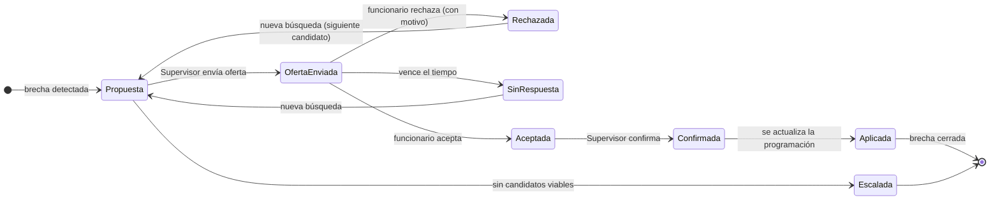
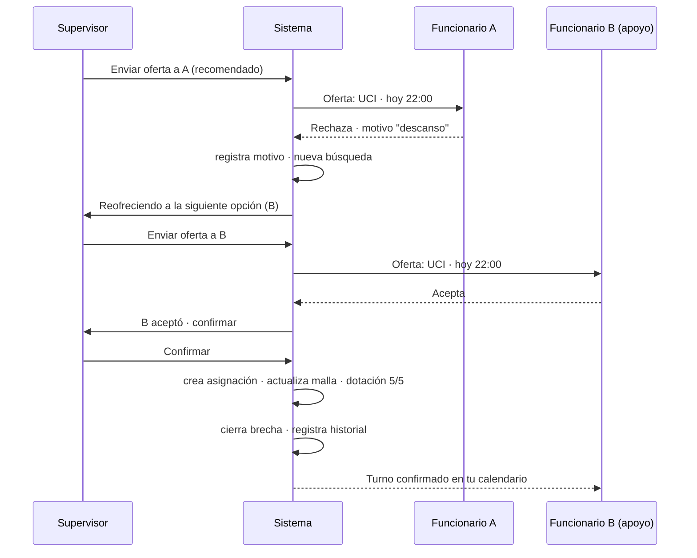

# 14 · Flujo completo de resolución de cobertura

> **Qué cubre:** todo lo que pasa desde que se envía una oferta para cubrir un turno hasta que la brecha se cierra y queda registrada: **envío de oferta → respuesta → rechazo con motivo → nueva búsqueda → aceptación → confirmación del Supervisor → actualización automática de la programación → cierre de brecha → trazabilidad.**
>
> Es la continuación natural del [13 · Inicio operativo](./13-inicio-supervisor-coordinador.md): el panel lateral abre este flujo. Se apoya en la fuente única de verdad ([05](./05-fuente-unica-de-verdad.md)) y los eventos de dominio ([09](./09-eventos-de-dominio.md)).

## 14.1 Actores del flujo

| Actor | Rol en el flujo |
|-------|-----------------|
| **Supervisor / Coordinador** | Inicia la resolución, elige candidato, envía la oferta, **confirma** el reemplazo o escala. |
| **Funcionario ofertado** | Recibe la oferta y responde: **acepta** o **rechaza con motivo**. |
| **Sistema (NEX Shift)** | Filtra candidatos elegibles, ordena por recomendación, aplica el reemplazo a la programación, cierra la brecha y **registra todo**. |

## 14.2 Máquina de estados

Dos ciclos avanzan en paralelo: la **cobertura** (la gestión) y la **brecha** (el problema).



Estado de la **brecha** en paralelo:

```
Detectada → Priorizada → EnGestión (hay oferta activa) → Resuelta (aceptada+confirmada) → Cerrada (aplicada)
                                                        ↘ Escalada (sin candidatos)
```

## 14.3 Paso a paso

### Paso 1 · Envío de oferta
- El Supervisor abre el panel de la brecha y ve **solo candidatos elegibles**: habilitados para esa unidad/rol y sin exceder su tope de horas. **Nunca aparece un candidato inválido.**
- Cada candidato trae su **razón de recomendación** en una línea (p. ej. *"Habilitada en UCI · 0 h extra · no deja otra brecha"*) y su **costo/impacto** (visible para Supervisor y Coordinador).
- El Supervisor elige uno (por defecto el recomendado ⭐) y pulsa **Enviar oferta**.
- **Sistema:** la cobertura pasa a `OfertaEnviada`; la **brecha pasa a `EnGestión`**; se notifica al funcionario; se registra el evento. La tarjeta en Inicio pasa a *En curso*.

> **Envío secuencial (regla confirmada):** se oferta a **un candidato a la vez**, respetando el **ranking NEX** de recomendación. **No hay difusión masiva.** Esto evita dobles compromisos y hace justo el orden.

**Plazo de respuesta según urgencia (confirmado).** Cada oferta tiene un tiempo máximo; al vencer, pasa **automáticamente** al siguiente candidato:

| Cuándo es el turno | Plazo para responder |
|--------------------|----------------------|
| **Hoy** | 30 minutos |
| **Mañana** | 2 horas |
| **Turnos posteriores** | 6 horas |

### Paso 2 · Respuesta del funcionario
El funcionario recibe la oferta (en su bandeja / notificación) con lo esencial: **qué turno, dónde, cuándo y hasta cuándo puede responder.** Dos caminos:

- **Acepta** → la cobertura pasa a `Aceptada`.
- **Rechaza con motivo** → ver Paso 3.
- **No responde** dentro del plazo → se trata como `SinRespuesta` (rechazo tácito) y dispara nueva búsqueda.

### Paso 3 · Rechazo con motivo
El rechazo **siempre pide un motivo** (obligatorio, de una lista breve + comentario opcional). Esto no es burocracia: alimenta la nueva búsqueda y la analítica.

Motivos típicos (lenguaje del funcionario):

| Motivo | Qué hace el sistema con él |
|--------|----------------------------|
| **No disponible ese día** | Descarta a la persona para ese turno; puede seguir elegible para otros. |
| **Vengo saliendo de turno / descanso** | Marca posible fatiga; evita reofrecer turnos contiguos. |
| **Motivo personal** | Solo registra; sin penalización. |
| **Distancia / traslado** | Registra; útil para priorizar cercanos a futuro. |
| **Prefiero otro turno** | Registra preferencia. |
| *(comentario libre opcional)* | Se guarda en la trazabilidad. |

- **Sistema:** cobertura → `Rechazada`; el candidato **sale de la cola** para esta brecha; se registra el evento **con el motivo**; se dispara automáticamente la **nueva búsqueda**.

### Paso 4 · Nueva búsqueda (automática)
- El sistema toma el **siguiente candidato elegible** según el ranking (recalculado, porque las condiciones pueden haber cambiado: horas, disponibilidad).
- Vuelve al **Paso 1** con ese candidato. El Supervisor ve *"Reofreciendo a la siguiente opción"* sin tener que rearmar nada.
- **Si se agotan los candidatos viables** → la brecha se marca `Escalada` y sube a Coordinación (y de ahí, si aplica, a Dirección). El flujo no queda "en el aire": siempre tiene salida.

### Paso 5 · Aceptación
- Cuando un funcionario **acepta**, la cobertura queda `Aceptada` y **a la espera de confirmación** del Supervisor.
- La aceptación **reserva** provisionalmente a la persona (para que no la oferten a otra brecha en paralelo).

### Paso 6 · Confirmación del Supervisor
- La aceptación **no aplica sola**: el Supervisor **confirma** para mantener el control humano de quién entra al turno. En la confirmación ve el resumen (quién, turno, costo/impacto).
- Al **Confirmar** → cobertura `Confirmada`.
- **Regla confirmada:** la confirmación del Supervisor es **siempre manual** (sin auto-confirmación por ahora). El control humano de quién entra al turno se mantiene en todos los casos.

### Paso 7 · Actualización automática de la programación
Al confirmarse, **el sistema actualiza la malla solo** (fuente única de verdad):
1. Crea la **asignación** del funcionario al turno, validando invariantes: **sin solapamiento** y **sin exceder tope de horas** ([02 §2.5](./02-modelo-de-dominio.md#25-invariantes-del-dominio-reglas-que-siempre-se-cumplen)).
2. El turno del funcionario aparece en **su calendario**.
3. El contador de **dotación** de la unidad sube (p. ej. de 4/5 a **5/5**).
4. Nadie edita la malla a mano: la confirmación **es** la actualización.

### Paso 8 · Cierre de brecha
- La nueva asignación hace que el motor recalcule el puesto: **oferta neta = demanda** → la **brecha se cierra** (`Cerrada`).
- En Inicio, la tarjeta **desaparece sola** y el estado de dotación vuelve a verde.
- Si por cualquier causa la asignación luego cae (el funcionario ya no puede), la brecha **se reabre** automáticamente y el flujo se reinicia.

### Paso 9 · Trazabilidad
Todo el recorrido queda registrado y consultable (ver §14.5).

## 14.4 Recorrido con la rama de rechazo (secuencia)



## 14.5 Trazabilidad (el historial de la cobertura)

Cada transición emite un **evento de dominio** con un **identificador de correlación** común (p. ej. `COB-2048`), de modo que toda la historia se reconstruye de punta a punta.

Se registra, por evento: **qué pasó · quién lo hizo · cuándo · dato clave (motivo, candidato, costo).**

| Momento | Evento | Actor | Se guarda |
|---------|--------|-------|-----------|
| Brecha detectada | `BrechaDetectada` | Sistema | unidad, turno, faltante, causa |
| Oferta enviada | `OfertaEnviada` | Supervisor | candidato, costo estimado |
| Rechazo | `CoberturaRechazada` | Funcionario A | **motivo** |
| Nueva búsqueda | `CoberturaPropuesta` | Sistema | siguiente candidato |
| Aceptación | `CoberturaAceptada` | Funcionario B | hora de aceptación |
| Confirmación | `CoberturaConfirmada` | Supervisor | quién confirmó |
| Programación | `AsignacionCreada` | Sistema | turno asignado |
| Cierre | `BrechaCerrada` | Sistema | **tiempo de resolución** |

**Visibilidad de la trazabilidad (confirmada):**
- **Supervisor / Coordinador:** ven el historial **completo** de la cobertura (todos los candidatos, motivos, tiempos).
- **Funcionario:** ve la trazabilidad de **su propia oferta y cobertura** (qué le ofrecieron, qué respondió, en qué quedó), **sin ver información de otros candidatos**.

**Para qué sirve la trazabilidad:**
- **Historial visible** de cada cobertura ("¿por qué este turno lo terminó cubriendo B y no A?").
- **Auditoría** (registro append-only, no editable).
- **Analítica:** tiempo medio de resolución, tipo de cobertura más usado, **motivos de rechazo frecuentes** (para actuar sobre la causa: fatiga, distancia, incentivos), y costo consolidado que ve Dirección.

## 14.6 Reglas y casos borde

| Situación | Qué hace el sistema |
|-----------|---------------------|
| **La oferta no se responde** | Al vencer el plazo (30 min / 2 h / 6 h según urgencia), se marca `SinRespuesta` y se reofrece automáticamente a la siguiente opción del ranking. |
| **El funcionario acepta pero deja de ser elegible** (p. ej. otra asignación) | Se invalida la aceptación antes de confirmar; vuelve a búsqueda. |
| **La causa desaparece** (p. ej. se anula la licencia) | La brecha se `Desestima` y la cobertura en curso se cancela; se notifica. |
| **Dos brechas compiten por el mismo candidato** | La aceptación **reserva** a la persona; la otra brecha lo excluye y busca alternativa. |
| **No hay candidatos viables** | La brecha se `Escala` a Coordinación / Dirección; nunca queda sin dueño. |
| **Confirmación de alto costo** | Requiere confirmación manual; Dirección lo ve consolidado en analítica. |

## 14.7 Decisiones validadas

- ✅ **Rechazo con motivo obligatorio**, registrado en la trazabilidad.
- ✅ **Confirmación del Supervisor siempre manual** (sin auto-confirmación por ahora).
- ✅ **Envío secuencial** (un candidato a la vez, ranking NEX); **sin difusión masiva**.
- ✅ **Plazos por urgencia:** hoy 30 min · mañana 2 h · posteriores 6 h. Al vencer, pasa automáticamente al siguiente candidato.
- ✅ **Trazabilidad para el Funcionario:** ve su propia oferta y cobertura, **no** la de otros candidatos.

Siguiente paso: **Programación / Malla** — ver [15 · Programación](./15-programacion-malla.md).
