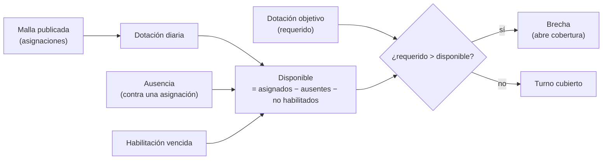
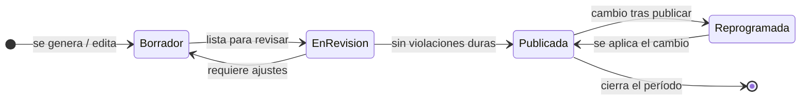
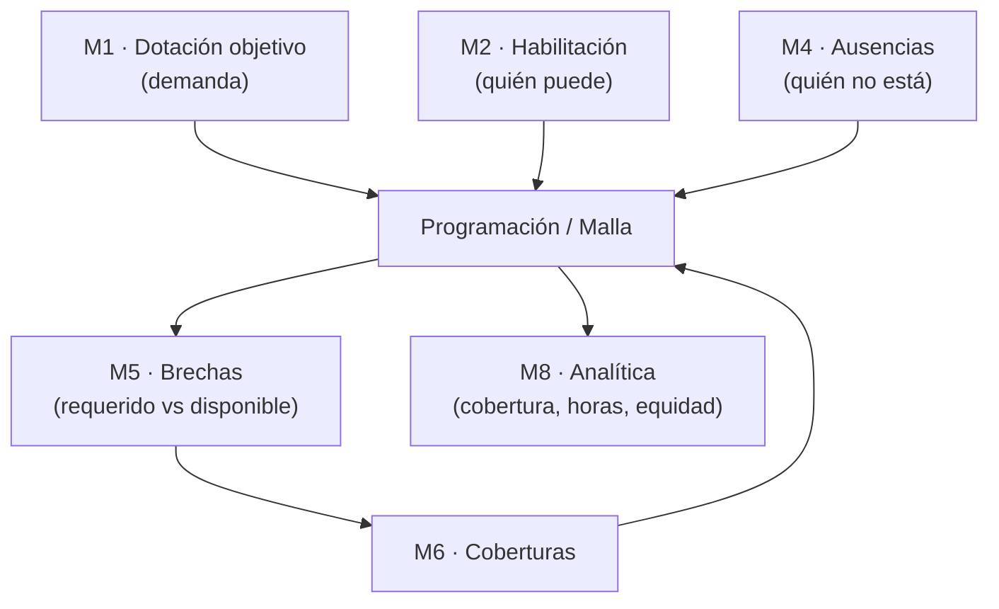

# 15 · Programación / Malla — lógica funcional

> **Por qué es el módulo central de la operación:** aquí se define *quién trabaja, cuándo y dónde*. La programación es la **"oferta" de personal**. De ella nacen la **dotación diaria**, el impacto de las **ausencias** y, por comparación con lo requerido, las **brechas**. Si la malla está bien pensada, hay menos brechas; si está mal, se disparan.
>
> Este documento define la **lógica funcional** en dos altitudes — **mensual** (planificar) y **diaria** (operar) — antes de diseñar pantallas. No incluye aún el Inicio del Funcionario.

## 15.1 Dos altitudes: planificar y operar

| | **Malla mensual** | **Malla diaria** |
|--|-------------------|-------------------|
| Pregunta | ¿Está bien cubierto todo el mes? | ¿Está cubierto el día de hoy/mañana? |
| Naturaleza | **Proactiva** — se planifica con antelación | **Reactiva** — se opera en tiempo real |
| Horizonte | El período (mes) completo | Hoy y los próximos turnos |
| Foco | Equidad, reglas, cobertura estructural | Ausencias de último momento, brechas inminentes |
| Quién | Supervisor (arma), Dirección (aprueba dotación) | Supervisor / Coordinador (operan y cubren) |

Ambas miran **los mismos datos** (una sola malla); cambia el **lente**.

## 15.2 Conceptos base

| Concepto | Definición |
|----------|-----------|
| **Período** | Rango que cubre la malla (típicamente un mes). |
| **Turno** | Bloque horario (p. ej. Mañana 08–16, Tarde 14–22, Noche 22–06). Configurable por unidad. |
| **Dotación objetivo** | Cuántas personas de cada rol se **requieren** por turno y día (la demanda). Puede variar por día de semana o estacionalidad. |
| **Asignación** | Una persona puesta en un turno concreto (día + unidad + turno). Es la "oferta". |
| **Patrón / ciclo de turnos** | Secuencia repetible que ordena turnos y descansos (p. ej. rotación día/noche con libres). Genera la malla base. |
| **Dotación diaria** | Suma de asignaciones para un día/turno. |
| **Disponible** | Dotación diaria − ausentes − no habilitados. |
| **Brecha** | Dotación objetivo − disponible, cuando es > 0. |
| **Estado de la malla** | Borrador · En revisión · Publicada · Reprogramada. |

## 15.3 La malla mensual (planificación)

**Objetivo:** que **todos los turnos del mes** queden cubiertos según la dotación objetivo, **respetando las reglas laborales** y con **carga equitativa** entre el personal.

### Insumos
1. **Dotación objetivo** por día/turno/rol (de [M1](./03-modulos-funcionales.md)).
2. **Personal disponible**: contratos, jornada/FTE, y **habilitación** por unidad ([M2](./03-modulos-funcionales.md)).
3. **Ausencias ya conocidas**: vacaciones y permisos planificados ([M4](./03-modulos-funcionales.md)).
4. **Patrones de turno** de la unidad.
5. **Reglas de negocio** (§15.6).

### Generación asistida
El sistema **propone una malla base** a partir de los patrones + las reglas + la demanda; el Supervisor la **ajusta**. No es una hoja en blanco ni una caja negra: es una **propuesta editable y explicada**.

### Validación antes de publicar
El sistema marca, en vivo:
- **Huecos**: turnos que quedan **bajo la dotación objetivo** (posibles brechas futuras).
- **Violaciones de reglas duras** (p. ej. descanso insuficiente, exceso de horas): impiden publicar hasta resolverse.
- **Alertas blandas** (p. ej. carga desigual, muchas noches seguidas): se pueden publicar, pero se avisan.

### Vista
Cuadrícula **persona × día**, con el turno de cada celda (M/T/N/L…). Debajo, por día, la **cobertura por turno** (asignados vs requerido). El estado de la malla siempre visible.

### Publicación
`Borrador → En revisión → Publicada`. Al **publicar**, la malla se vuelve **fuente de verdad**: desde ese momento, cualquier cambio (una ausencia, una edición) **genera eventos** y **recalcula brechas** ([05](./05-fuente-unica-de-verdad.md)).

## 15.4 La malla diaria (operación)

**Objetivo:** operar el día — ver la **dotación real vs requerida** por turno, absorber **ausencias de último momento**, y detectar/lanzar la resolución de **brechas inminentes**.

### Vista
Por **turno del día** (Mañana / Tarde / Noche), cada uno muestra:
- **Requerido** vs **asignados** vs **disponible** (descontando ausentes y no habilitados).
- **Estado**: Completo (verde) · En riesgo (ámbar) · Insuficiente (rojo).
- La **lista de personas** del turno, con su estado (presente / ausente hoy).

### Acciones
- Registrar una **ausencia del día** → recalcula disponible → si cae bajo el mínimo, **nace la brecha** y se puede **abrir la cobertura** (flujo del [doc 14](./14-flujo-resolucion-cobertura.md)) sin salir de aquí.
- **Look-ahead**: resalta los **próximos turnos en riesgo** (hoy y mañana) para adelantarse.

## 15.5 Cómo la programación origina ausencias, dotación y brechas

- La **dotación diaria** es, literalmente, lo que dice la malla para ese día.
- Una **ausencia** siempre se registra **contra una asignación** de la malla → por eso "la programación origina las ausencias" (sin asignación no hay a qué faltar).
- La **brecha** es el resultado de comparar requerido vs disponible. **Nace en la programación.**

## 15.6 Reglas de negocio de la malla

Dos tipos: **duras** (no se pueden violar; bloquean la publicación) y **blandas** (se optimizan; solo advierten).

### Reglas duras
| Regla | Qué asegura |
|-------|-------------|
| **Descanso mínimo entre turnos** | No encadenar, p. ej., Noche → Mañana sin descanso suficiente. |
| **Tope de horas** (semanal/mensual) | No superar la jornada del contrato; controla horas extra. |
| **Sin solapamiento** | Una persona no puede estar en dos turnos a la vez. |
| **Habilitación requerida** | Solo se asigna a quien está habilitado para esa unidad/rol. |
| **Cobertura mínima de seguridad** | Ningún turno bajo el mínimo seguro (según criticidad de la unidad). |

### Reglas blandas (optimización)
| Regla | Qué mejora |
|-------|-----------|
| **Carga equitativa** | Repartir turnos, noches y fines de semana de forma justa. |
| **Máximo de noches consecutivas** | Evitar fatiga acumulada. |
| **Continuidad / preferencias** | Respetar preferencias y estabilidad de equipos cuando se pueda. |
| **Distribución de libres** | Descansos bien repartidos. |

> Las reglas son **configurables** por el Administrador ([M9](./03-modulos-funcionales.md)) según la normativa y la unidad. La malla mensual las usa para **prevenir** brechas; la diaria, para no crear una nueva al cubrir otra.

## 15.7 Ciclo de vida de la malla

- En **Borrador** los cambios no generan brechas ni notifican (aún se está planificando).
- Al **Publicar**, la malla es fuente de verdad; los cambios posteriores (**Reprogramada**) **sí** generan eventos, recalculan brechas y notifican a los afectados.

## 15.8 Relación con los demás módulos (una sola verdad)

- **Recibe** demanda (M1), habilitación (M2) y ausencias (M4).
- **Produce** la base sobre la que M5 calcula brechas.
- **Es modificada** por las coberturas confirmadas (M6) — que es cómo se cierra el ciclo.
- **Alimenta** la analítica (M8): % de cobertura, horas, equidad, reprogramaciones.

## 15.9 Experiencia de uso (mensual vs diaria)

- **Planificar (mensual):** el Supervisor genera la malla asistida, resuelve las alertas duras, equilibra la carga y **publica**. Trabajo periódico (una vez al mes, con ajustes).
- **Operar (diaria):** cada día ve la dotación real por turno, absorbe ausencias y **cubre las brechas** desde la misma vista. Trabajo continuo.
- **Un solo lugar, dos lentes:** se pasa de mensual a diaria sin cambiar de módulo; es la misma malla vista distinto.

## 15.10 Qué validar

1. **¿Los turnos base** (Mañana/Tarde/Noche) y sus horarios son los de tu servicio, o usan otros (p. ej. turnos de 12 h, cuarto turno)?
2. **¿Las reglas duras de §15.6** son las correctas y completas para tu normativa? ¿Falta alguna (p. ej. noches máximas por mes)?
3. **¿La generación asistida** (el sistema propone y tú ajustas) es lo que esperas, o prefieres armar la malla 100% manual al inicio?
4. **¿La dotación objetivo varía** por día de semana / temporada, o es fija por turno?
5. **¿Quién publica** la malla y quién debe **aprobarla** antes de publicar (Supervisor solo, o con visto de Dirección)?
