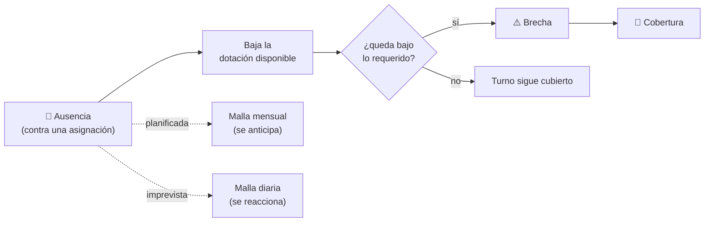
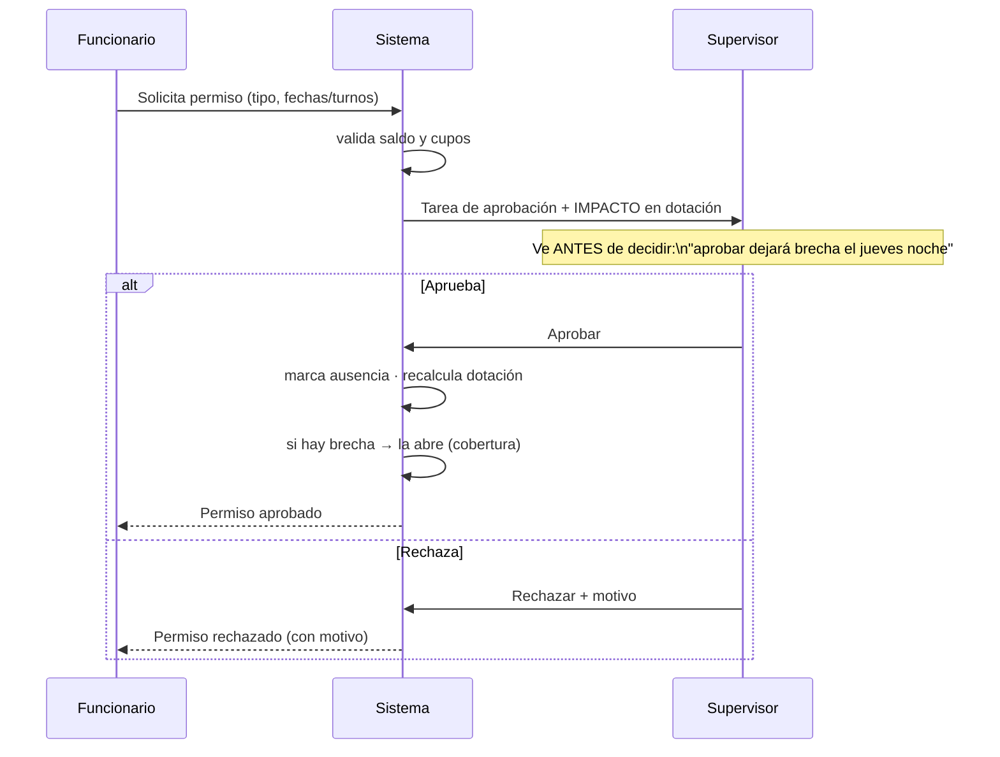

# 16 · Ausencias — el evento que conecta todo

> **Por qué es el eje operativo:** una ausencia es el **hecho** que enlaza los cuatro módulos del latido. Se registra **contra una asignación** de la programación, **reduce la dotación** disponible, **puede abrir una brecha** y **dispara una cobertura**. Es la causa más frecuente de brechas.
>
> Este documento define la lógica funcional de Ausencias antes de las pantallas, apoyándose en [15 · Programación](./15-programacion-malla.md) y el [14 · Flujo de cobertura](./14-flujo-resolucion-cobertura.md).

## 16.1 La ausencia como conector



Una ausencia **no vive sola**: siempre golpea a la programación y, desde ahí, a la dotación, las brechas y las coberturas. Por eso se diseña después de la malla y antes de operar.

## 16.2 Tipos de ausencia

Se dividen por **previsibilidad**, que determina cómo impactan:

### Planificadas (con antelación)
| Tipo | Requiere aprobación | Notas |
|------|:---:|-------|
| **Vacaciones** | Sí | Consume saldo; sujeta a cupos simultáneos. |
| **Permiso administrativo** | Sí | Consume saldo de permisos. |
| **Capacitación / formación** | Sí | Conecta con Desarrollo ([M7](./03-modulos-funcionales.md)). |
| **Permisos legales** (matrimonio, fallecimiento, etc.) | Sí | Según normativa; documentación. |
| **Día compensatorio** | Sí | Devuelve tiempo trabajado. |

### Imprevistas (de último momento)
| Tipo | Requiere aprobación | Notas |
|------|:---:|-------|
| **Licencia médica** | No (se **registra**) | Impacta de inmediato; validación documental **en paralelo**, no bloquea la operación. |
| **Emergencia familiar** | No / posterior | Se registra y se cubre; se regulariza después. |
| **Inasistencia** | No | Se registra el hecho para dotación y para gestión posterior. |

Cada tipo tiene atributos: **¿requiere aprobación?**, **¿afecta disponibilidad?**, **¿consume saldo?**, **¿requiere documento?**, **¿es planificable?**. Configurables por el Administrador ([M9](./03-modulos-funcionales.md)).

## 16.3 Ciclos de vida

**Planificada (solicitud):**
```
Solicitada → EnRevisión → Aprobada → (impacta malla) → [Anulada]
                        ↘ Rechazada (con motivo)
```

**Imprevista (registro directo):**
```
Registrada → (impacta malla de inmediato) → Validada / Regularizada
                                          ↘ Objetada (si no se justifica)
```

La diferencia clave: la **planificada se aprueba antes de impactar**; la **imprevista impacta primero y se valida después** (porque la operación no puede esperar a un certificado).

## 16.4 Flujo de solicitud y aprobación (planificada)



**Lo esencial:** el Supervisor ve el **impacto en la dotación antes de aprobar**. No aprueba a ciegas: sabe si esa vacación deja un turno en brecha y puede decidir con esa información (aprobar y cubrir, o rechazar con motivo).

## 16.5 Flujo de ausencia imprevista (licencia médica)

1. El funcionario **avisa** (o el Supervisor/una integración la **registra**).
2. La ausencia **impacta de inmediato** la disponibilidad de la malla diaria.
3. Si el turno queda bajo el mínimo → **brecha** → se abre la **cobertura** (doc 14).
4. En **paralelo**, se gestiona la **documentación** (certificado en el plazo normativo). Si no se justifica → queda `Objetada`, pero **eso no frena** la cobertura ni la operación.

> Esta separación —operar primero, validar después— es deliberada: ante una licencia médica, cubrir el turno es urgente; el papeleo va por otro carril.

## 16.6 Impacto en la dotación y en la malla

- Toda ausencia se registra **contra una asignación** concreta (persona + día + turno). Sin asignación, no hay ausencia que registrar.
- **Planificada:** se refleja en la **malla mensual**, así la brecha **se ve venir** y se puede cubrir con tiempo (mejores opciones, menor costo).
- **Imprevista:** golpea la **malla diaria**; se reacciona con el flujo de cobertura.
- El recálculo es **automático** (fuente única de verdad): aprobar/registrar una ausencia recalcula la dotación y, si corresponde, abre la brecha sin intervención manual.

## 16.7 Reglas de negocio de ausencias

| Regla | Qué asegura |
|-------|-------------|
| **Cupos simultáneos** | Limita cuántas personas pueden estar ausentes a la vez. **Configurable por unidad, tipo de ausencia y estamento** (no un valor fijo). |
| **Saldo / derechos** | Feriado legal, permisos administrativos, compensatorios y otros. **Los administra RR.HH.;** NEX Shift los **consume y valida automáticamente** al solicitar (no se pide más de lo disponible). |
| **Antelación mínima** (planificadas) | Las vacaciones/permisos se piden con la anticipación configurada. |
| **Documentación** (imprevistas) | La licencia médica exige certificado dentro de un plazo; su falta genera objeción, no bloqueo operativo. |
| **Aprobación según impacto** | Si la ausencia deja una **brecha crítica**, la aprobación exige confirmación consciente (y puede escalar). |
| **Reevaluación al retorno** | Ausencias largas pueden requerir **reevaluar la habilitación** al volver (conecta con [M2](./03-modulos-funcionales.md)). |

## 16.8 Vista y experiencia

- **Funcionario:** solicita (elige tipo, rango, ve su **saldo**), consulta el **estado** de sus solicitudes y su historial. *(La pantalla de Inicio del Funcionario se diseña aparte, más adelante.)*
- **Supervisor:** **bandeja de solicitudes con impacto en dotación**, aprueba/rechaza, **registra imprevistas**, y consulta el **calendario de ausencias del equipo** para no aprobar solapes que dejen huecos.
- **Calendario de ausencias del equipo:** vista clave para planificar — muestra quién está ausente y cuándo, y avisa cuando se acumulan demasiadas ausencias en un mismo día (regla de cupos).

## 16.9 Relación con los módulos y eventos

| Evento | Emite | Reaccionan | Efecto |
|--------|-------|-----------|--------|
| `AusenciaSolicitada` | Ausencias | Notificaciones | Tarea de aprobación al Supervisor. |
| `AusenciaAprobada` | Ausencias | **Brechas**, Analítica | Baja disponibilidad → puede abrir brecha. |
| `AusenciaRegistrada` (imprevista) | Ausencias | **Brechas**, Coberturas | Impacto inmediato → brecha → cobertura. |
| `AusenciaRechazada` | Ausencias | Notificaciones | Se informa al funcionario con motivo. |
| `AusenciaAnulada` | Ausencias | **Brechas**, Coberturas | Restaura disponibilidad → puede cerrar/cancelar. |

## 16.10 Casos borde

| Situación | Qué hace el sistema |
|-----------|---------------------|
| **Se anula una ausencia ya cubierta** | Restaura la disponibilidad; si había una cobertura en gestión, la **cancela** o avisa; la brecha se `Desestima`. |
| **Ausencia parcial** (medio turno) | Reduce disponibilidad proporcional; la brecha se calcula sobre el tramo afectado. |
| **Ausencia que se extiende** | Se prolonga el rango; recalcula las brechas de los nuevos días. |
| **Vacaciones que dejarían la unidad bajo mínimo** | La regla de **cupos simultáneos** advierte y puede impedir la aprobación hasta reorganizar. |
| **Licencia sin certificado en plazo** | Queda `Objetada` para gestión, sin afectar la cobertura ya realizada. |

## 16.11 Decisiones validadas

- ✅ **Impacto en dotación visible antes de aprobar.**
- ✅ **Cupos simultáneos configurables** por unidad, tipo de ausencia y estamento (no fijo).
- ✅ **Licencia médica: impacto inmediato sin aprobación previa;** validación documental en paralelo.
- ✅ **Saldos** (feriado legal, permisos administrativos, compensatorios y otros) **administrados por RR.HH.;** NEX Shift los **consume y valida automáticamente**.
- ✅ Patrón base de turnos: **cuarto turno** (Largo → Noche → Libre → Libre), coherente con [15](./15-programacion-malla.md).

Siguiente paso: **Habilitación y Competencias** — la puerta de elegibilidad antes del Índice NEX — ver [17 · Habilitación](./17-habilitacion-competencias.md).

### Integración con RR.HH. (saldos)
NEX Shift **no es el dueño** de los saldos: los lee desde RR.HH. y los **valida en el momento de solicitar** (feriado legal, permisos, compensatorios). Si el saldo no alcanza, la solicitud se bloquea con un mensaje claro. El consumo confirmado se **informa de vuelta** a RR.HH. para mantener una sola verdad.
