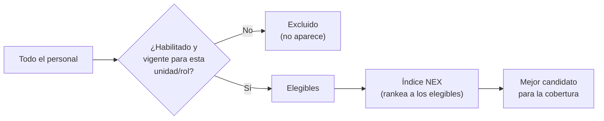
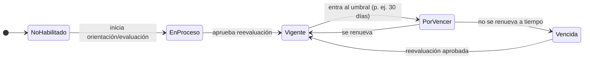

# 17 · Habilitación y Competencias — la puerta de elegibilidad

> **Qué define este módulo:** *quién puede trabajar y cubrir cada unidad*. Es el **filtro duro de elegibilidad** que se aplica **antes** de rankear candidatos. Nadie que no esté habilitado y vigente aparece como opción para cubrir un turno.
>
> **Su relación con el Índice NEX:** Habilitación responde **"¿quién PUEDE?"** (elegibilidad, binaria). El **Índice NEX** responde **"¿quién es el MEJOR?"** (ranking, entre los elegibles). Este módulo **alimenta la elegibilidad**; el Índice NEX ordena lo que aquí queda habilitado. Primero la puerta, después el orden.

## 17.1 Por qué es una "restricción dura"

En un contexto clínico, poner a alguien en un turno para el que no está habilitado es un **riesgo de seguridad**. Por eso la habilitación no es una sugerencia: es una **barrera**. El sistema **nunca ofrece** un candidato no habilitado (salvo excepción autorizada y auditada, §17.8).

## 17.2 Conceptos

| Concepto | Definición |
|----------|-----------|
| **Competencia** | Capacidad verificable (p. ej. *ventilación mecánica*, *drogas vasoactivas*, *RCP avanzado*, *triage*, *manejo de pabellón*). |
| **Unidad base** | La unidad de pertenencia del funcionario. **Siempre mantiene su habilitación** en ella (ver §17.3). |
| **Requisito mínimo (por unidad y estamento)** | El conjunto **mínimo** de competencias que exige una unidad para un estamento. Es lo único que **bloquea** una cobertura en otra unidad. |
| **Competencia adicional** | Competencia más allá del mínimo. **Nunca bloquea** una cobertura; **solo mejora el ranking** (Índice NEX). |
| **Habilitación** | Estado que confirma que una persona **puede** cubrir una unidad/rol porque cumple los **requisitos mínimos** vigentes. |
| **Vigencia** | Competencias y reevaluaciones **vencen**; cada una con su propia vigencia. |
| **Estamento** | Categoría profesional (enfermero/a, TENS, matrón/a, médico/a…). Los requisitos mínimos varían por estamento. |
| **Reevaluación** | Proceso que otorga o renueva habilitación. **Tres tipos, cada uno con vigencia independiente:** **Orientación** (inducción a la unidad), **Evaluación de desempeño** (interna) y **Certificación** (acreditación, p. ej. RCP). |

## 17.3 Estados de la habilitación

| Estado | ¿Elegible en su **unidad base**? | ¿Elegible en **otra unidad**? |
|--------|:---:|:---:|
| **Vigente** | ✅ Sí | ✅ Sí |
| **Por vencer** (≤ umbral) | ✅ Sí (con alerta) | ✅ Sí (con alerta) |
| **Vigente · Reevaluación requerida** | ✅ **Sí** (nunca se excluye de su unidad base) | ⚠️ Según requisito mínimo |
| **En proceso** | — | ❌ No (aún no habilitado) |
| **Requisito mínimo no cumplido** | n/a | ❌ No |

**Reglas confirmadas:**
- **La unidad base siempre mantiene la habilitación.** Si una orientación o evaluación **vence**, no se excluye: se muestra **"Habilitación vigente · Reevaluación requerida"** (alerta para regularizar, sin sacar a la persona de su unidad).
- **Por vencer sigue siendo elegible**, con alerta, para actuar antes de que caiga.
- Para **otras unidades**, lo único que bloquea es **no cumplir el requisito mínimo**. Las **competencias adicionales nunca bloquean**: solo mejoran el ranking en el Índice NEX.

## 17.4 La matriz de habilitación (quién puede cubrir cada unidad)

El corazón operativo del módulo es una **matriz persona × unidad**: para cada unidad, el estado de habilitación de cada funcionario. Responde de un vistazo *"¿quién puede cubrir UCI esta noche?"*.

- Una persona puede estar habilitada en **varias unidades** (p. ej. UCI + Urgencias) → **amplía su capacidad de cobertura** y el valor del equipo de apoyo.
- La matriz se **calcula**: el estado por unidad es el resultado de comparar las competencias vigentes de la persona con los requisitos de esa unidad. No se edita a mano.

## 17.5 Cómo alimenta la elegibilidad (antes del Índice NEX)

Cuando hay una brecha en (unidad U, rol R, turno T):

1. **Filtro de elegibilidad (este módulo):** el pool = personas que **cumplen el requisito mínimo** de (U, R) con vigencia (Vigente o Por vencer). En su **unidad base**, siempre elegibles. El resto **no aparece**.
2. **Combinado con otras restricciones duras:** también se excluye a quien tenga **solapamiento** o **exceda su tope de horas** ([15](./15-programacion-malla.md)).
3. **Las competencias adicionales pasan como dato de ranking**, no como filtro: quien tiene más competencias para esa unidad **sube** en el Índice NEX, pero quien solo cumple el mínimo **igual entra**.
4. **Entrega al Índice NEX:** sobre ese pool ya limpio, el Índice NEX aplica su ranking (costo, idoneidad, fatiga, cercanía, equidad…). Ver [18 · Índice NEX](./18-indice-nex.md).

> La habilitación es **la primera compuerta**. Si está mal, el Índice NEX rankearía candidatos inválidos. Por eso este módulo va **antes**.

## 17.6 Vencimientos, reevaluaciones y su impacto

- **Umbral "por vencer": 30 días por defecto, configurable por competencia** (cada competencia/reevaluación puede tener su propio umbral). Al entrar en el umbral, se genera la alerta **"reevaluación pendiente"** que aparece en Inicio ([12](./12-inicio-bandeja.md)).
- Cada tipo de reevaluación (**Orientación, Evaluación de desempeño, Certificación**) tiene **vigencia independiente**: puede vencer una sin que caigan las otras.
- Cuando una competencia obligatoria **vence**, la habilitación de las unidades que la exigen pasa a **Vencida** → la persona **sale del pool** → **puede abrir brechas** en turnos donde ya estaba asignada (conecta con [M5](./03-modulos-funcionales.md)).
- La **reevaluación** (orientación/evaluación/certificación) renueva la vigencia. Al aprobarse, la persona vuelve al pool automáticamente.
- **Reevaluación al retorno de ausencias largas** (conecta con [16](./16-ausencias.md)): algunas ausencias prolongadas exigen reevaluar antes de volver a habilitar.

## 17.7 Reglas de negocio

| Regla | Qué asegura |
|-------|-------------|
| **Todas las obligatorias vigentes** | La habilitación requiere **todas** las competencias obligatorias de la unidad, vigentes. Falta una → no habilitado. |
| **Vencida = fuera** | Una competencia vencida invalida la habilitación de las unidades que la exigen. |
| **Requisitos por estamento** | Lo exigido depende del estamento y rol. |
| **Configurable** | Competencias, requisitos por unidad y umbrales de vencimiento los define el Administrador ([M9](./03-modulos-funcionales.md)). |
| **Trazabilidad** | Cada otorgamiento/renovación/vencimiento queda registrado (quién evaluó, cuándo, hasta cuándo). |

## 17.8 Excepción autorizada (caso borde)

En una urgencia extrema puede asignarse a alguien que **no cumple el requisito mínimo**. Esta excepción:
- **Solo la otorga el Administrador** (ningún otro perfil, tampoco Dirección).
- Requiere **motivo obligatorio**.
- Queda **auditada** y marcada como excepción.

No es un atajo operativo: es una válvula de emergencia trazable y de un solo responsable.

## 17.9 Relación con los módulos y eventos

| Evento | Emite | Reaccionan | Efecto |
|--------|-------|-----------|--------|
| `HabilitacionOtorgada` | Habilitación | Coberturas, Brechas | Amplía el pool de candidatos válidos. |
| `HabilitacionPorVencer` | Habilitación | Notificaciones, Desarrollo | Alerta de reevaluación pendiente. |
| `HabilitacionVencida` | Habilitación | **Brechas**, Programación | Saca del pool → puede abrir brecha. |
| `HabilitacionRenovada` | Habilitación | Coberturas, Brechas | Restaura elegibilidad. |
| `AccionFormativaCompletada` | Desarrollo (M7) | **Habilitación** | Otorga una nueva competencia/habilitación. |

- **Alimenta** a Programación (solo asigna habilitados) y a la **elegibilidad** de Coberturas.
- **Consume** de Desarrollo ([M7](./03-modulos-funcionales.md)): formar personal **crea capacidad** (nuevas habilitaciones = más candidatos para cubrir).

## 17.10 Vista y experiencia

- **Supervisor / Coordinador:** la **matriz de habilitación** (quién puede cubrir cada unidad) y la lista de **reevaluaciones por vencer** del equipo.
- **Funcionario:** su **ficha de competencias** — qué tiene, en qué unidades está habilitado y qué vence pronto. *(La pantalla de Inicio del Funcionario se diseña aparte.)*
- **Administrador:** catálogo de competencias, requisitos por unidad/estamento y umbrales.

## 17.11 Decisiones validadas

- ✅ **Unidad base siempre habilitada:** si vence una orientación/evaluación, se muestra **"Habilitación vigente · Reevaluación requerida"**, sin excluir.
- ✅ **Otras unidades:** solo bloquea el **requisito mínimo** (por unidad y estamento). Las **competencias adicionales nunca bloquean; solo mejoran el ranking**.
- ✅ **"Por vencer" elegible con alerta.** Umbral **30 días por defecto, configurable por competencia**.
- ✅ **Reevaluación en tres tipos** con vigencia independiente: **Orientación, Evaluación de desempeño, Certificación**.
- ✅ **Excepción autorizada: solo el Administrador**, con motivo obligatorio y trazabilidad (Dirección queda fuera).

Siguiente paso: **Índice NEX** — el ranking transparente de los candidatos ya elegibles — ver [18 · Índice NEX](./18-indice-nex.md).
