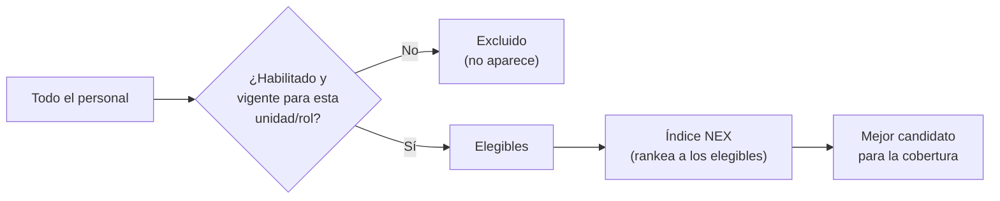
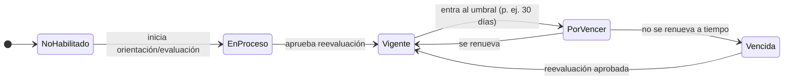

# 17 · Habilitación y Competencias — la puerta de elegibilidad

> **Qué define este módulo:** *quién puede trabajar y cubrir cada unidad*. Es el **filtro duro de elegibilidad** que se aplica **antes** de rankear candidatos. Nadie que no esté habilitado y vigente aparece como opción para cubrir un turno.
>
> **Su relación con el Índice NEX:** Habilitación responde **"¿quién PUEDE?"** (elegibilidad, binaria). El **Índice NEX** responde **"¿quién es el MEJOR?"** (ranking, entre los elegibles). Este módulo **alimenta la elegibilidad**; el Índice NEX ordena lo que aquí queda habilitado. Primero la puerta, después el orden.

## 17.1 Por qué es una "restricción dura"

En un contexto clínico, poner a alguien en un turno para el que no está habilitado es un **riesgo de seguridad**. Por eso la habilitación no es una sugerencia: es una **barrera**. El sistema **nunca ofrece** un candidato no habilitado (salvo excepción autorizada y auditada, §17.8).

## 17.2 Conceptos

| Concepto | Definición |
|----------|-----------|
| **Competencia** | Capacidad verificable (p. ej. *ventilación mecánica*, *drogas vasoactivas*, *RCP avanzado*, *triage*, *manejo de pabellón*). |
| **Requisito de unidad/rol** | Qué competencias exige una unidad para un rol. **Obligatorias** (sin ellas no hay habilitación) y **deseables** (suman, no bloquean). |
| **Habilitación** | Estado que confirma que una persona **puede** trabajar en una unidad/rol porque tiene las competencias obligatorias **vigentes**. |
| **Vigencia** | Toda habilitación/competencia puede **vencer**. Al vencer, deja de habilitar. |
| **Estamento** | Categoría profesional (enfermero/a, TENS, matrón/a, médico/a…). Los requisitos varían por estamento. |
| **Reevaluación** | El proceso que **otorga o renueva** una habilitación: **orientación** (inducción a la unidad), **evaluación** (interna) o **certificación** (acreditación). |

## 17.3 Estados de la habilitación

| Estado | ¿Elegible para cubrir? |
|--------|:---:|
| **Vigente** | ✅ Sí |
| **Por vencer** | ✅ Sí (con aviso — priorizar renovación) |
| **En proceso** | ❌ No (aún no habilitado) |
| **Vencida** | ❌ No |
| **No habilitado** | ❌ No |

> **Por vencer sigue siendo elegible**, pero se marca para actuar antes de que caiga. **En proceso, vencida y no habilitado quedan fuera** del pool de candidatos.

## 17.4 La matriz de habilitación (quién puede cubrir cada unidad)

El corazón operativo del módulo es una **matriz persona × unidad**: para cada unidad, el estado de habilitación de cada funcionario. Responde de un vistazo *"¿quién puede cubrir UCI esta noche?"*.

- Una persona puede estar habilitada en **varias unidades** (p. ej. UCI + Urgencias) → **amplía su capacidad de cobertura** y el valor del equipo de apoyo.
- La matriz se **calcula**: el estado por unidad es el resultado de comparar las competencias vigentes de la persona con los requisitos de esa unidad. No se edita a mano.

## 17.5 Cómo alimenta la elegibilidad (antes del Índice NEX)

Cuando hay una brecha en (unidad U, rol R, turno T):

1. **Filtro de elegibilidad (este módulo):** el pool de candidatos = personas con habilitación **Vigente o Por vencer** para (U, R). El resto **no aparece**.
2. **Combinado con otras restricciones duras:** también se excluye a quien tenga **solapamiento** o **exceda su tope de horas** ([15](./15-programacion-malla.md)).
3. **Entrega al Índice NEX:** sobre ese pool ya limpio, el Índice NEX aplica su ranking (costo, horas, fatiga, cercanía, equidad…). *(El Índice NEX se detalla en su propio documento.)*

> La habilitación es **la primera compuerta**. Si está mal, el Índice NEX rankearía candidatos inválidos. Por eso este módulo va **antes**.

## 17.6 Vencimientos, reevaluaciones y su impacto

- **Umbral "por vencer"** configurable (p. ej. 30 días). Al entrar en el umbral, se genera la alerta **"reevaluación pendiente"** que aparece en Inicio ([12](./12-inicio-bandeja.md)).
- Cuando una competencia obligatoria **vence**, la habilitación de las unidades que la exigen pasa a **Vencida** → la persona **sale del pool** → **puede abrir brechas** en turnos donde ya estaba asignada (conecta con [M5](./03-modulos-funcionales.md)).
- La **reevaluación** (orientación/evaluación/certificación) renueva la vigencia. Al aprobarse, la persona vuelve al pool automáticamente.
- **Reevaluación al retorno de ausencias largas** (conecta con [16](./16-ausencias.md)): algunas ausencias prolongadas exigen reevaluar antes de volver a habilitar.

## 17.7 Reglas de negocio

| Regla | Qué asegura |
|-------|-------------|
| **Todas las obligatorias vigentes** | La habilitación requiere **todas** las competencias obligatorias de la unidad, vigentes. Falta una → no habilitado. |
| **Vencida = fuera** | Una competencia vencida invalida la habilitación de las unidades que la exigen. |
| **Requisitos por estamento** | Lo exigido depende del estamento y rol. |
| **Configurable** | Competencias, requisitos por unidad y umbrales de vencimiento los define el Administrador ([M9](./03-modulos-funcionales.md)). |
| **Trazabilidad** | Cada otorgamiento/renovación/vencimiento queda registrado (quién evaluó, cuándo, hasta cuándo). |

## 17.8 Excepción autorizada (caso borde)

En una urgencia extrema, un perfil con **permiso especial** puede asignar a alguien **no habilitado**. Esto:
- Requiere **justificación** obligatoria.
- Queda **auditado** y marcado como excepción.
- Es visible para Dirección.

No es un atajo operativo: es una válvula de emergencia trazable.

## 17.9 Relación con los módulos y eventos

| Evento | Emite | Reaccionan | Efecto |
|--------|-------|-----------|--------|
| `HabilitacionOtorgada` | Habilitación | Coberturas, Brechas | Amplía el pool de candidatos válidos. |
| `HabilitacionPorVencer` | Habilitación | Notificaciones, Desarrollo | Alerta de reevaluación pendiente. |
| `HabilitacionVencida` | Habilitación | **Brechas**, Programación | Saca del pool → puede abrir brecha. |
| `HabilitacionRenovada` | Habilitación | Coberturas, Brechas | Restaura elegibilidad. |
| `AccionFormativaCompletada` | Desarrollo (M7) | **Habilitación** | Otorga una nueva competencia/habilitación. |

- **Alimenta** a Programación (solo asigna habilitados) y a la **elegibilidad** de Coberturas.
- **Consume** de Desarrollo ([M7](./03-modulos-funcionales.md)): formar personal **crea capacidad** (nuevas habilitaciones = más candidatos para cubrir).

## 17.10 Vista y experiencia

- **Supervisor / Coordinador:** la **matriz de habilitación** (quién puede cubrir cada unidad) y la lista de **reevaluaciones por vencer** del equipo.
- **Funcionario:** su **ficha de competencias** — qué tiene, en qué unidades está habilitado y qué vence pronto. *(La pantalla de Inicio del Funcionario se diseña aparte.)*
- **Administrador:** catálogo de competencias, requisitos por unidad/estamento y umbrales.

## 17.11 Qué validar

1. **¿Las competencias y los requisitos por unidad** (UCI, Urgencias, Pabellón, etc.) son los correctos para tu institución?
2. **¿"Por vencer" debe seguir siendo elegible** (con aviso), o prefieres excluirlo del pool desde que entra al umbral?
3. **¿La reevaluación** distingue bien **orientación / evaluación / certificación**, o usan otros nombres/procesos?
4. **¿Qué umbral** de "por vencer" usamos (30 días u otro), y varía por tipo de competencia?
5. **¿La excepción autorizada** (asignar a un no habilitado en urgencia) existe en tu operación, y quién tendría ese permiso?
