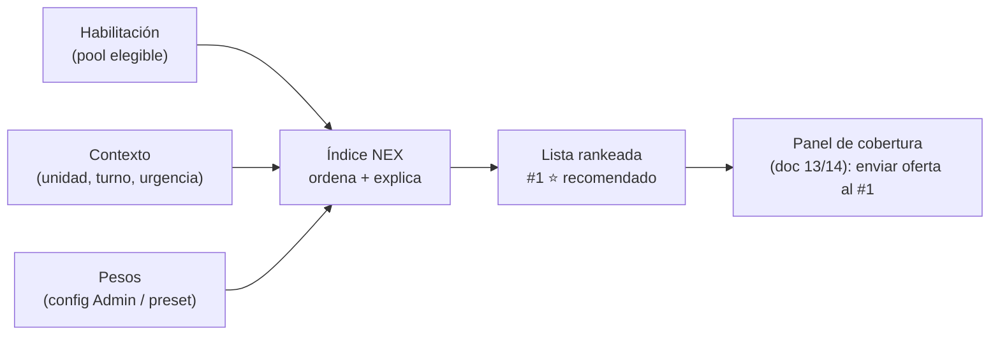

# 18 · Índice NEX — ranking transparente de candidatos

> **Qué es:** el algoritmo que **ordena a los candidatos ya elegibles** (los que pasaron el filtro de [Habilitación](./17-habilitacion-competencias.md)) de mejor a peor para una cobertura concreta, con un puntaje **transparente y explicable**, mostrando **por qué** se recomienda a cada uno.
>
> **Lo que NO hace:** no decide quién puede (eso es Habilitación). No es una caja negra. No inventa candidatos. **Solo ordena a los elegibles y explica el orden.**

## 18.1 Principios

1. **Solo elegibles.** El Índice NEX **nunca** ve a un no elegible. La compuerta dura (habilitación, horas, solapamiento) ya se aplicó. NEX ordena; no filtra.
2. **Transparente y explicable.** El puntaje es una **suma ponderada de factores comprensibles**. Cada candidato muestra su desglose y una **razón en lenguaje claro**. Nada de "el sistema lo dijo".
3. **Configurable, no arbitrario.** Los **pesos** de cada factor los define el Administrador y pueden ajustarse por **urgencia** (un turno de hoy prioriza distinto que uno planificado). El cambio de pesos **re-ordena a la vista**, sin sorpresas.
4. **Justo.** Incluye **equidad** para no llamar siempre a la misma persona.
5. **Reproducible.** Mismo contexto + mismos pesos = mismo orden. Auditable.

## 18.2 Los factores (criterios del puntaje)

Cada factor se normaliza a **0–100** (más alto = mejor para cubrir). Son pocos y entendibles:

| Factor | Qué mide | Sube cuando… |
|--------|----------|--------------|
| **Costo** | Cuánto cuesta esta cobertura. | Es reasignación o equipo de apoyo (sin costo extra). Baja con hora extra o refuerzo externo. |
| **Idoneidad** | Qué tan bien calza con la unidad. | Cumple el mínimo **y** tiene competencias adicionales; habilitación plena (baja si es "por vencer"). |
| **Disponibilidad y fatiga** | Si puede sin sobrecargarse. | Tiene horas disponibles, descanso adecuado, no viene saliendo de noche. |
| **Equidad** | Reparto justo de la carga. | Ha cubierto **poco** últimamente (rota parejo). Baja si se le ha llamado mucho. |
| **Cercanía / respuesta** | Rapidez para asumir. | Está cerca o disponible de inmediato (clave si el turno es hoy). |
| **Continuidad** | Conocimiento de la unidad. | Cubre esa unidad con frecuencia (la conoce). |

> Las **competencias adicionales** entran aquí, en **Idoneidad** — mejoran el puntaje, **nunca bloquean** ([17](./17-habilitacion-competencias.md)).

## 18.3 La fórmula

```
Índice NEX (0–100) = Σ ( peso_factor × valor_factor )  /  Σ ( peso_factor )
```

- Suma ponderada, normalizada por la suma de pesos (así los pesos no tienen que sumar 100).
- **Pesos por defecto** (configurables):

| Factor | Peso |
|--------|:---:|
| Costo | 25 |
| Idoneidad | 20 |
| Disponibilidad y fatiga | 20 |
| Equidad | 15 |
| Cercanía / respuesta | 10 |
| Continuidad | 10 |

- **Perfiles por urgencia** (presets que cambian los pesos):
  - **Urgente (turno de hoy):** sube *Cercanía* y *Disponibilidad*; el tiempo manda.
  - **Planificado:** sube *Costo* y *Equidad*; hay margen para optimizar.

## 18.4 Explicabilidad: por qué se recomienda

Para cada candidato, el sistema genera:

1. **El puntaje NEX** (0–100) y su **posición** en el ranking.
2. **El desglose por factor** (barras/valores): se ve qué lo sube y qué lo baja.
3. **Una razón en lenguaje claro**, construida con sus **factores más fuertes** y sus **alertas**:

> *"Recomendada (NEX 85). Porque: sin costo extra (equipo de apoyo), habilitada y vigente en UCI, con descanso adecuado. Atención: nada pendiente."*

> *"NEX 64. Sube por: es de la unidad, disponible de inmediato. Baja por: implica hora extra (costo alto) y ha cubierto mucho esta semana."*

La **razón siempre nombra lo positivo y lo negativo**, para que la decisión del Supervisor sea informada, no ciega.

## 18.5 Cómo se integra en el flujo



- El **#1** del Índice NEX es el **⭐ recomendado** que ya aparecía en el panel de cobertura ([13](./13-inicio-supervisor-coordinador.md)) y en el flujo ([14](./14-flujo-resolucion-cobertura.md)).
- El **envío secuencial** de ofertas respeta este ranking: si el #1 rechaza, se ofrece al #2, y así ([14](./14-flujo-resolucion-cobertura.md)).

## 18.6 Reglas y garantías

| Regla | Qué asegura |
|-------|-------------|
| **No filtra** | Si alguien está en la lista, es porque es elegible. NEX nunca excluye. |
| **Desempate transparente** | Ante igualdad de puntaje, desempata por **equidad** y luego por antigüedad de la última cobertura. Documentado, no aleatorio. |
| **Alertas visibles** | "Por vencer", "al límite de horas" o "costo alto" se muestran junto al puntaje, no se esconden. |
| **Pesos auditables** | Qué pesos se usaron en cada recomendación queda registrado (trazabilidad). |
| **Sin aprendizaje opaco** | La base es una fórmula explicable. Si a futuro se suma aprendizaje, será **sobre factores visibles**, nunca reemplazando la explicación. |

## 18.7 Configurabilidad (Administrador)

- **Pesos por factor** (globales y por urgencia).
- **Perfiles por unidad:** una UCI puede pesar más la idoneidad; una unidad de menor complejidad, el costo.
- **Umbrales de alerta** (p. ej. "cerca del tope de horas").
- Lo que **no** se configura aquí: la compuerta de habilitación (eso vive en [M2](./03-modulos-funcionales.md)).

## 18.8 Qué validar

1. **¿Los seis factores** (costo, idoneidad, disponibilidad/fatiga, equidad, cercanía, continuidad) son los correctos, o falta/sobra alguno?
2. **¿Los pesos por defecto** reflejan tu criterio, y tiene sentido cambiarlos por **urgencia**?
3. **¿La equidad** debe pesar más para evitar sobrecargar a los mismos, o priorizas siempre el menor costo?
4. **¿La razón en lenguaje claro** (positivo + alerta) es suficiente para que el Supervisor confíe en la recomendación?
5. **¿Quién puede ajustar los pesos** — solo Administrador, o también el Coordinador para su operación?
