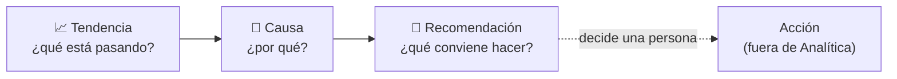

# 19 · Analítica e Inteligencia (Subdirección)

> **Qué es:** la capa que convierte la operación en **decisión**. No repite los tableros operativos del Supervisor/Coordinador: le da a **Subdirección** la mirada táctico-estratégica — **tendencias, causas y recomendaciones** — sobre dotación, ausentismo, brechas, coberturas, costos, riesgo y capacidad.
>
> **Principio rector (confirmado):** las **predicciones apoyan decisiones; no ejecutan cambios automáticos.** NEX Shift recomienda; **una persona decide** y actúa.

## 19.1 Audiencia y propósito

- **Audiencia:** **Subdirección** (gestión). No opera turnos: **decide, prioriza y asigna recursos**.
- **Propósito:** responder *"¿cómo vamos, por qué, y qué conviene hacer?"* con datos del propio sistema (una sola verdad), sin planillas paralelas.
- **Diferencia con lo operativo:** el Supervisor ve *su turno de hoy*; Subdirección ve **patrones en el tiempo y entre unidades**.

## 19.2 Las tres capas de toda lectura

Cada indicador se presenta en tres niveles, siempre en este orden:



- **Tendencia:** el dato en el tiempo (sube, baja, se estabiliza).
- **Causa:** el porqué, cruzando módulos (p. ej. el ausentismo sube por licencias en un servicio).
- **Recomendación:** una sugerencia accionable ("reforzar el pool de UCI para el próximo mes").
- **La acción la ejecuta una persona**, en el módulo correspondiente. Analítica **no cambia nada**.

## 19.3 Panel de indicadores

Todos los indicadores pedidos, con su lectura de tres capas:

| Indicador | Qué mide | Causa que suele explicarlo | Recomendación tipo |
|-----------|----------|----------------------------|--------------------|
| **Dotación** | Cobertura real vs. requerida (%). | Subdotación estructural / ausencias. | Ajustar dotación objetivo o pool. |
| **Ausentismo** | % de ausencias sobre lo programado. | Licencias médicas, sobrecarga, estacionalidad. | Anticipar refuerzos en meses/servicios pico. |
| **Brechas** | Detectadas, resueltas y **crónicas**. | Ausencias + subdotación + vencimientos. | Intervenir unidades con brecha recurrente. |
| **Tiempos de cobertura** | Tiempo medio de resolución de una brecha. | Pool pequeño, rechazos, poca disponibilidad. | Ampliar pool / mejorar incentivos. |
| **Rechazos** | Cuántas ofertas se rechazan y **por qué**. | Fatiga, distancia, descanso, preferencias. | Actuar sobre el motivo dominante. |
| **Sobrecarga** | Horas extra y carga por persona/unidad. | Cobrir con los mismos; pool insuficiente. | Redistribuir; formar más habilitados. |
| **Costos** | Costo de coberturas por tipo (hora extra, refuerzo externo…). | Uso de opciones caras por falta de alternativas. | Sustituir costo alto por pool/reasignación. |
| **Unidades críticas** | Ranking de unidades por riesgo compuesto. | Combinación de las causas anteriores. | Priorizar recursos en el top. |
| **Habilitaciones por vencer** | Reevaluaciones próximas a caducar. | Certificaciones/orientaciones sin renovar. | Programar reevaluaciones antes del vencimiento. |
| **Capacidad de reemplazo** | Cuántos elegibles hay por unidad (pool efectivo). | Pocos habilitados multi-unidad. | Formar para ampliar elegibilidad. |
| **Riesgo futuro** | Proyección de brechas/ausentismo. | Tendencias + estacionalidad + vencimientos. | Preparar el próximo período (advisory). |

## 19.4 Unidades críticas (índice compuesto)

Para priorizar, Subdirección necesita un **ranking de unidades por riesgo**. Se calcula como un **índice compuesto y transparente** (mismo espíritu que el [Índice NEX](./18-indice-nex.md)):

```
Riesgo de unidad = f( brecha crónica, ausentismo, sobrecarga,
                      capacidad de reemplazo (inversa), habilitaciones por vencer )
```

Cada unidad muestra su puntaje **y sus factores** (por qué está arriba), no solo un número. Así la priorización es defendible.

## 19.5 Capacidad de reemplazo y habilitaciones por vencer

- **Capacidad de reemplazo:** cuántas personas **elegibles** hay realmente para cada unidad (viene de [Habilitación](./17-habilitacion-competencias.md)). Una unidad con pocas personas habilitadas es **frágil** aunque hoy no tenga brechas.
- **Habilitaciones por vencer:** las reevaluaciones (orientación, evaluación, certificación) próximas a caducar. Ver esto **antes** evita que un vencimiento **reduzca la capacidad** y abra brechas.
- Juntas responden: *"¿qué tan sólido es mi banco de reemplazos y qué lo puede debilitar pronto?"*

## 19.6 Riesgo futuro (forecast) — solo apoyo

- Proyecta **ausentismo y brechas** del próximo período a partir de histórico, estacionalidad y vencimientos conocidos.
- Se muestra como **tendencia con banda de incertidumbre** y un **nivel de riesgo** por período/unidad.
- **Qué NO hace:** no reprograma, no aprueba, no envía ofertas, no cambia dotación. Solo **señala** para que Subdirección decida. Toda proyección va acompañada de su **recomendación** y de la **acción humana** sugerida.

## 19.7 Relación con los módulos (derivado y de solo lectura)

- **Consume** eventos e histórico de Programación, Ausencias, Brechas, Coberturas y Habilitación.
- Es **derivado y de solo lectura**: no es dueño de datos operativos; los **calcula** ([05 · SSOT](./05-fuente-unica-de-verdad.md)). Puede reconstruirse desde cero.
- **Alimenta** decisiones de Subdirección que luego se ejecutan en los módulos operativos (por una persona).

## 19.8 Gobernanza y confianza

| Regla | Qué asegura |
|-------|-------------|
| **No ejecuta** | Ningún cálculo cambia la operación. Solo informa y recomienda. |
| **Transparente** | Todo índice muestra sus factores; el forecast, su banda de incertidumbre. |
| **Trazable** | Los datos vienen de eventos auditables; una cifra siempre se puede "abrir". |
| **Consolidado para Subdirección** | Los costos y comparativas se ven agregados (coherente con [13](./13-inicio-supervisor-coordinador.md): el costo por caso lo ven Supervisor/Coordinador). |

## 19.9 Qué validar

1. **¿Los indicadores de §19.3** cubren lo que Subdirección necesita, o falta/sobra alguno?
2. **¿El índice de unidades críticas** con esos factores refleja tu forma de priorizar?
3. **¿El horizonte del forecast** (próximo mes / trimestre) y su presentación como *apoyo* son los correctos?
4. **¿Las recomendaciones** deben enlazar a la acción (abrir el módulo para ejecutarla), manteniendo que **la decisión es humana**?
5. **¿Qué comparativas** importan más: entre unidades, contra meta, o contra el mismo mes del año anterior?
