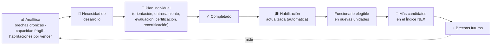
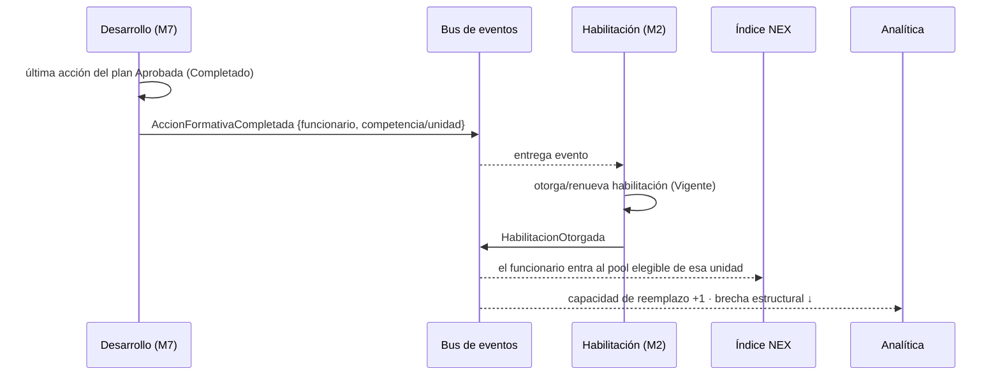

# 20 · Desarrollo Profesional (M7) — el lazo de capacidad

> **Qué cierra:** el ciclo **Analítica → Brechas → Habilitación → Índice NEX**. Cada brecha (sobre todo las crónicas) y cada capacidad frágil que detecta la Analítica **se transforma en una necesidad de desarrollo**. Al completarse, **la habilitación se actualiza automáticamente** y el funcionario **pasa a ser elegible para nuevas unidades** — ampliando el pool que alimenta al Índice NEX y reduciendo brechas futuras.
>
> Es la palanca de **capacidad futura**: no cubre el turno de hoy, construye el equipo que cubrirá los de mañana.

## 20.1 El lazo de capacidad



El lazo **se cierra solo**: la operación genera datos, los datos revelan dónde falta capacidad, el desarrollo la construye, y esa capacidad vuelve a la operación como más gente elegible.

## 20.2 De la brecha a la necesidad de desarrollo

Toda necesidad de desarrollo nace de una de dos fuentes, ambas provistas por [Analítica](./19-analitica-inteligencia.md):

| Fuente | Necesidad | Ejemplo |
|--------|-----------|---------|
| **Ampliar capacidad** (brecha crónica / pool frágil) | Habilitar a más personas para una unidad. | UCI tiene solo 5 elegibles → formar 2 más. |
| **Mantener capacidad** (habilitaciones por vencer) | Recertificar antes del vencimiento. | 6 personas con RCP por vencer → recertificación. |

Cada necesidad se resuelve con una o varias **acciones de desarrollo** (los cinco tipos):

| Acción | Para qué | Se conecta con Habilitación como… |
|--------|----------|-----------------------------------|
| **Orientación** | Inducción a una unidad nueva. | Reevaluación tipo *Orientación*. |
| **Entrenamiento / Capacitación** | Adquirir una competencia (p. ej. ventilación mecánica). | Prepara para la evaluación/certificación. |
| **Evaluación de desempeño** | Verificar que la competencia se domina. | Reevaluación tipo *Evaluación de desempeño*. |
| **Certificación** | Acreditar formalmente (p. ej. RCP avanzado). | Reevaluación tipo *Certificación*. |
| **Recertificación** | Renovar una certificación por vencer. | Renueva la vigencia. |

> Los tres tipos de reevaluación de [Habilitación](./17-habilitacion-competencias.md) (Orientación, Evaluación de desempeño, Certificación) son exactamente los que aquí se planifican y ejecutan. Desarrollo **produce** lo que Habilitación **verifica**.

## 20.3 Componentes del módulo

### Matriz de competencias por funcionario
Persona × competencia, con el **estado** de cada una: **Vigente**, **Por vencer**, **En progreso** (hay un plan activo), **No tiene**, o **Requerida** (la unidad objetivo la exige y falta). Es el mapa que muestra **dónde están las brechas de competencia** y qué falta para habilitar a alguien en otra unidad.

### Planes individuales de desarrollo
Por funcionario, un **plan** con un objetivo claro (p. ej. *"Habilitar en UCI"*), compuesto de **acciones** ordenadas, cada una con **responsable**, **fecha objetivo**, **estado** y **progreso**.

### Vencimientos
Las competencias/certificaciones con vigencia próxima generan **planes de recertificación** automáticamente propuestos.

### Capacitaciones
El **catálogo** de orientaciones, cursos y entrenamientos disponibles, con inscripción y cupos. Las acciones de un plan se enganchan a estas capacitaciones.

### Progreso
Cada acción y cada plan muestran su **avance** (pendiente → en curso → evaluación → completada) y el % global.

### Responsables
Cada acción tiene un **responsable** nombrado: tutor de orientación, formador, evaluador/a, jefatura. Nadie "en general": siempre una persona rinde cuentas.

### Trazabilidad
Historial completo: quién orientó/evaluó/certificó, cuándo, con qué resultado y evidencia. Append-only y auditable (igual que el resto del sistema).

### Indicadores
Ver §20.8.

## 20.4 Ciclos de vida

**Plan de desarrollo:**
```
Propuesto → Activo → EnProgreso → Completado → (Habilitación actualizada)
                                ↘ Suspendido / Cancelado
```

**Acción de desarrollo:**
```
Pendiente → EnCurso → EnEvaluación → Aprobada → Completada
                                   ↘ Reprobada → reintento
```

Una acción **reprobada** no cierra la puerta: se reintenta (con trazabilidad de los intentos).

## 20.5 Cierre automático del ciclo

Este es el corazón de M7 y de la promesa "al completar un plan, la habilitación se actualiza automáticamente":



- **Sin pasos manuales entre módulos:** completar el plan **es** habilitar. La persona aparece de inmediato como elegible en la unidad nueva ([05 · SSOT](./05-fuente-unica-de-verdad.md)).
- El efecto es medible: el **pool efectivo** de esa unidad sube y el Índice NEX tiene una opción más.

## 20.6 Roles

| Perfil | Qué hace en Desarrollo |
|--------|------------------------|
| **Supervisor** | Detecta necesidades de su equipo, propone/asigna planes, **es responsable de orientaciones y evaluaciones** en su unidad, sigue el progreso. |
| **Coordinador de Coberturas** | Ve la capacidad **transversal**; prioriza la formación que **más amplía el pool** para cubrir (menos escaladas, menor costo). |
| **Subdirección** | Ve el **retorno**: cuánta capacidad se gana, qué brechas estructurales se cierran, y **aprueba la inversión** en formación. |

*(El Funcionario participa en su propio plan, pero su pantalla — el Inicio del Funcionario — se diseña al final, según lo acordado.)*

## 20.7 Integración y eventos

| Evento | Emite | Reaccionan | Efecto |
|--------|-------|-----------|--------|
| `NecesidadDesarrolloDetectada` | Analítica → Desarrollo | Desarrollo | Propone un plan a partir de una brecha crónica / vencimiento. |
| `PlanCreado` / `AccionAsignada` | Desarrollo | Notificaciones | Tarea al responsable y al funcionario. |
| `AccionCompletada` | Desarrollo | Desarrollo | Avanza el plan. |
| `AccionFormativaCompletada` (plan completo) | Desarrollo | **Habilitación** | Otorga/renueva habilitación. |
| `HabilitacionOtorgada` | Habilitación | **NEX**, Analítica | Nuevo elegible → mejora capacidad. |

- **Con Habilitación:** comparten el catálogo de competencias y los requisitos; Desarrollo **produce**, Habilitación **certifica y habilita**.
- **Con Analítica:** las necesidades **entran** desde la analítica; los resultados (capacidad ganada) **vuelven** a ella.
- **Con Brechas / NEX:** más habilitados = pool más grande = mejores opciones de cobertura y menos brechas.

## 20.8 Indicadores

| Indicador | Qué mide | Para quién |
|-----------|----------|-----------|
| **Cobertura de competencias críticas** | % de la dotación con las competencias clave vigentes. | Todos |
| **Planes activos / completados** | Volumen y avance de la formación. | Supervisor / Coordinador |
| **Capacidad ganada** | Nuevos elegibles por unidad en el período. | Coordinador / Subdirección |
| **Recertificaciones a tiempo** | % de habilitaciones renovadas antes de vencer. | Todos |
| **Brechas de competencia abiertas** | Requisitos de unidad sin suficiente personal habilitado. | Subdirección |
| **Retorno de formación** | Brechas/costos reducidos tras ampliar capacidad. | Subdirección |

## 20.9 Qué validar

1. **¿Los cinco tipos de acción** (orientación, entrenamiento, evaluación, certificación, recertificación) cubren tu realidad, o falta alguno?
2. **¿La conversión automática brecha → necesidad de desarrollo** debe ser una **propuesta** que el Supervisor confirma, o algo que se crea solo?
3. **¿Los responsables** de orientación/evaluación/certificación son los correctos (Supervisor, formador, evaluador)?
4. **¿La actualización automática de la habilitación** al completar el plan es lo esperado, o requiere una validación final humana?
5. **¿Qué indicadores** de §20.8 son los que Subdirección usará para aprobar inversión en formación?
